# Web-Based POS System - Complete Diagrams

This document contains all Mermaid diagrams and flowcharts for the MyChair Web-Based POS System.

**Table of Contents:**
- [Architecture Diagrams](#architecture-diagrams)
- [Component Diagrams](#component-diagrams)
- [Data Flow Diagrams](#data-flow-diagrams)
- [Sequence Diagrams](#sequence-diagrams)
- [State Diagrams](#state-diagrams)
- [Database Diagrams](#database-diagrams)
- [Concurrency & Queue Diagrams](#concurrency--queue-diagrams)
- [User Journey Diagrams](#user-journey-diagrams)
- [Deployment Diagrams](#deployment-diagrams)
- [Migration Diagrams](#migration-diagrams)
- [Integration Diagrams](#integration-diagrams)
- [Security Diagrams](#security-diagrams)

---

## List of Essential + Important Diagrams (13 diagrams)
### Essential Diagrams (7)
1. System Architecture Overview - High-level view of all components
2. Order Creation Flow - From product selection to invoice creation
3. Server Command Flow - Device → Master command processing
4. Concurrent Order Editing - Multiple waiters editing same order (locking)
5. Order State Machine - Order lifecycle (Pending → Active → Completed)
6. Core Database Schema - Invoices, PendingInvoices, Customers, Products
7. On-Premises Deployment - Local network setup
### Important Diagrams (6)
1. Complete Order Sequence - Waiter takes order → Kitchen receives → Payment
2. Pending Order Flow - Save, retrieve, and convert pending orders
3. Payment Processing Flow - Complete checkout workflow
4. Optimistic Locking Flow - Version-based concurrency control
5. Backend API Component Structure - Controllers, Services, Repositories
6. Frontend PWA Component Structure - Blazor components hierarchy

---

## Architecture Diagrams

### 1. System Architecture Overview

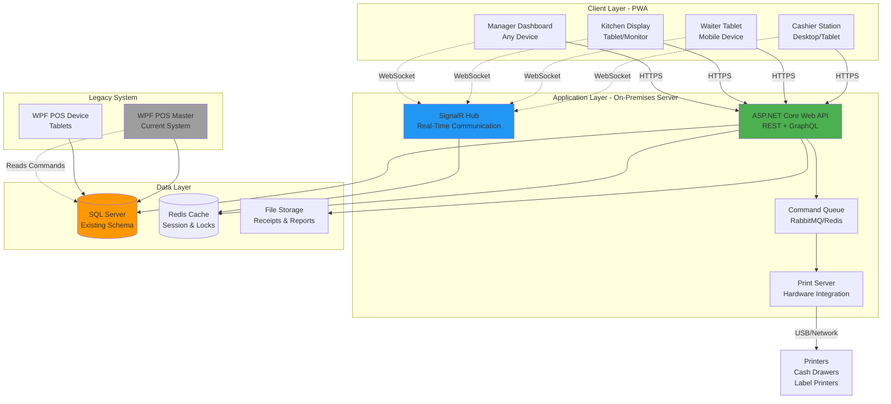
```mermaid
graph TB
    subgraph "Client Layer - PWA"
        C1[Cashier Station<br/>Desktop/Tablet]
        C2[Waiter Tablet<br/>Mobile Device]
        C3[Kitchen Display<br/>Tablet/Monitor]
        C4[Manager Dashboard<br/>Any Device]
    end
    
    subgraph "Application Layer - On-Premises Server"
        API[ASP.NET Core Web API<br/>REST + GraphQL]
        HUB[SignalR Hub<br/>Real-Time Communication]
        QUEUE[Command Queue<br/>RabbitMQ/Redis]
        PRINT[Print Server<br/>Hardware Integration]
    end
    
    subgraph "Data Layer"
        DB[(SQL Server<br/>Existing Schema)]
        CACHE[(Redis Cache<br/>Session & Locks)]
        FILES[File Storage<br/>Receipts & Reports]
    end
    
    subgraph "Legacy System"
        WPF[WPF POS Master<br/>Current System]
        DEVICE[WPF POS Device<br/>Tablets]
    end
    
    C1 & C2 & C3 & C4 -->|HTTPS| API
    C1 & C2 & C3 & C4 -.->|WebSocket| HUB
    
    API --> DB
    API --> CACHE
    API --> QUEUE
    HUB --> CACHE
    
    QUEUE --> PRINT
    PRINT -->|USB/Network| HARDWARE[Printers<br/>Cash Drawers<br/>Label Printers]
    
    WPF --> DB
    DEVICE --> DB
    WPF -.->|Reads Commands| DB
    
    API --> FILES
    
    style API fill:#4CAF50
    style HUB fill:#2196F3
    style DB fill:#FF9800
    style WPF fill:#9E9E9E
```

### 2. Network Topology Diagram

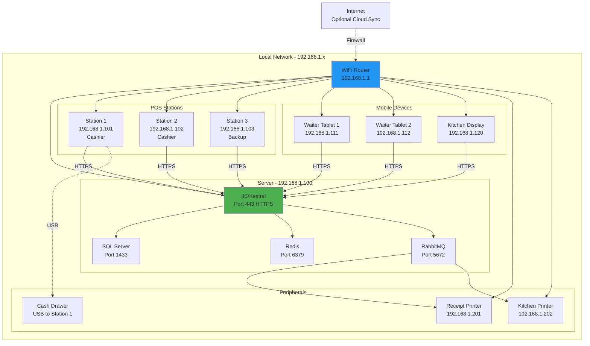
```mermaid
graph TB
    subgraph "Local Network - 192.168.1.x"
        subgraph "Server - 192.168.1.100"
            IIS[IIS/Kestrel<br/>Port 443 HTTPS]
            SQL[SQL Server<br/>Port 1433]
            REDIS[Redis<br/>Port 6379]
            RABBIT[RabbitMQ<br/>Port 5672]
        end
        
        subgraph "POS Stations"
            STATION1[Station 1<br/>192.168.1.101<br/>Cashier]
            STATION2[Station 2<br/>192.168.1.102<br/>Cashier]
            STATION3[Station 3<br/>192.168.1.103<br/>Backup]
        end
        
        subgraph "Mobile Devices"
            TABLET1[Waiter Tablet 1<br/>192.168.1.111]
            TABLET2[Waiter Tablet 2<br/>192.168.1.112]
            TABLET3[Kitchen Display<br/>192.168.1.120]
        end
        
        subgraph "Peripherals"
            PRINTER1[Receipt Printer<br/>192.168.1.201]
            PRINTER2[Kitchen Printer<br/>192.168.1.202]
            DRAWER[Cash Drawer<br/>USB to Station 1]
        end
        
        ROUTER[WiFi Router<br/>192.168.1.1]
    end
    
    ROUTER --> IIS
    ROUTER --> STATION1 & STATION2 & STATION3
    ROUTER --> TABLET1 & TABLET2 & TABLET3
    ROUTER --> PRINTER1 & PRINTER2
    
    STATION1 & STATION2 & STATION3 -->|HTTPS| IIS
    TABLET1 & TABLET2 & TABLET3 -->|HTTPS| IIS
    
    IIS --> SQL
    IIS --> REDIS
    IIS --> RABBIT
    
    RABBIT --> PRINTER1 & PRINTER2
    STATION1 -.->|USB| DRAWER
    
    INTERNET[Internet<br/>Optional Cloud Sync] -.->|Firewall| ROUTER
    
    style IIS fill:#4CAF50
    style ROUTER fill:#2196F3
```

### 3. Hybrid Architecture (Current + New)

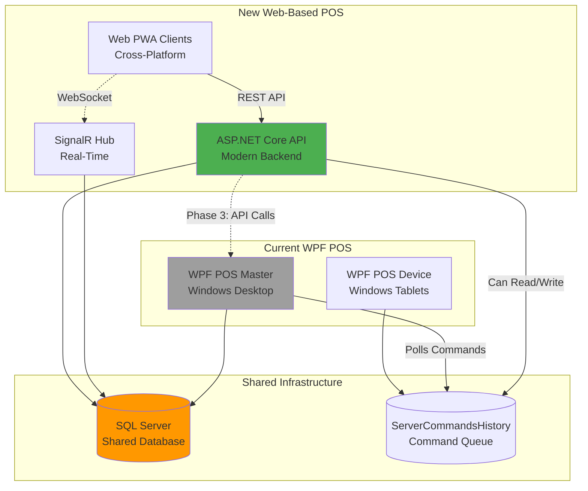
```mermaid
graph TB
    subgraph "New Web-Based POS"
        WEB_CLIENT[Web PWA Clients<br/>Cross-Platform]
        WEB_API[ASP.NET Core API<br/>Modern Backend]
        SIGNALR[SignalR Hub<br/>Real-Time]
    end
    
    subgraph "Current WPF POS"
        WPF_MASTER[WPF POS Master<br/>Windows Desktop]
        WPF_DEVICE[WPF POS Device<br/>Windows Tablets]
    end
    
    subgraph "Shared Infrastructure"
        DB[(SQL Server<br/>Shared Database)]
        COMMANDS[(ServerCommandsHistory<br/>Command Queue)]
    end
    
    WEB_CLIENT -->|REST API| WEB_API
    WEB_CLIENT -.->|WebSocket| SIGNALR
    WEB_API --> DB
    SIGNALR --> DB
    
    WPF_MASTER --> DB
    WPF_DEVICE --> COMMANDS
    WPF_MASTER -->|Polls Commands| COMMANDS
    
    WEB_API -->|Can Read/Write| COMMANDS
    
    WEB_API -.->|Phase 3: API Calls| WPF_MASTER
    
    style WEB_API fill:#4CAF50
    style WPF_MASTER fill:#9E9E9E
    style DB fill:#FF9800
```

### 4. Microservices Architecture (Future-Ready)

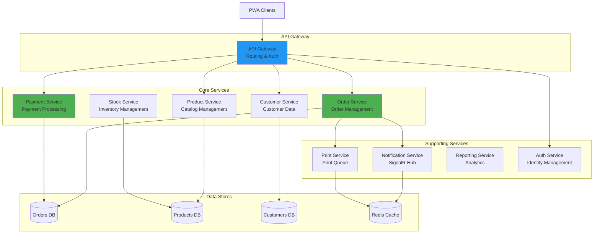
```mermaid
graph TB
    subgraph "API Gateway"
        GATEWAY[API Gateway<br/>Routing & Auth]
    end
    
    subgraph "Core Services"
        ORDER_SVC[Order Service<br/>Order Management]
        PAYMENT_SVC[Payment Service<br/>Payment Processing]
        PRODUCT_SVC[Product Service<br/>Catalog Management]
        CUSTOMER_SVC[Customer Service<br/>Customer Data]
        STOCK_SVC[Stock Service<br/>Inventory Management]
    end
    
    subgraph "Supporting Services"
        PRINT_SVC[Print Service<br/>Print Queue]
        NOTIFY_SVC[Notification Service<br/>SignalR Hub]
        REPORT_SVC[Reporting Service<br/>Analytics]
        AUTH_SVC[Auth Service<br/>Identity Management]
    end
    
    subgraph "Data Stores"
        ORDER_DB[(Orders DB)]
        PRODUCT_DB[(Products DB)]
        CUSTOMER_DB[(Customers DB)]
        CACHE[(Redis Cache)]
    end
    
    CLIENT[PWA Clients] --> GATEWAY
    
    GATEWAY --> ORDER_SVC
    GATEWAY --> PAYMENT_SVC
    GATEWAY --> PRODUCT_SVC
    GATEWAY --> CUSTOMER_SVC
    GATEWAY --> AUTH_SVC
    
    ORDER_SVC --> ORDER_DB
    ORDER_SVC --> NOTIFY_SVC
    ORDER_SVC --> PRINT_SVC
    
    PAYMENT_SVC --> ORDER_DB
    PRODUCT_SVC --> PRODUCT_DB
    CUSTOMER_SVC --> CUSTOMER_DB
    STOCK_SVC --> PRODUCT_DB
    
    NOTIFY_SVC --> CACHE
    PRINT_SVC --> CACHE
    
    style GATEWAY fill:#2196F3
    style ORDER_SVC fill:#4CAF50
    style PAYMENT_SVC fill:#4CAF50
```

---

## Component Diagrams

### 5. Backend API Component Structure

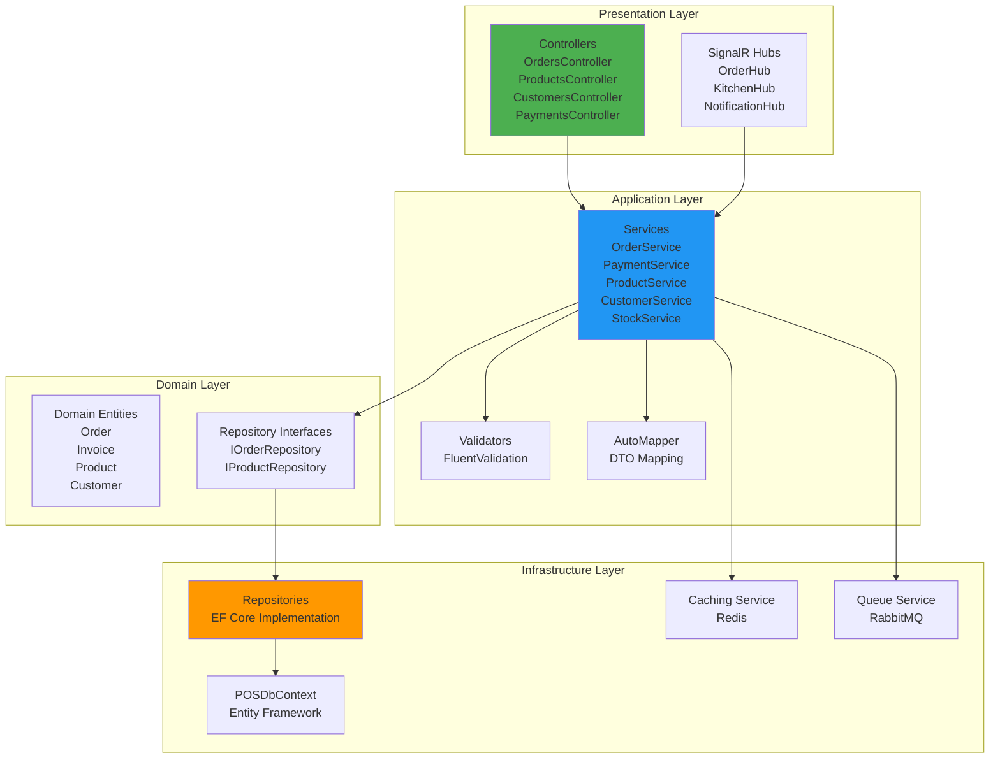
```mermaid
graph TB
    subgraph "Presentation Layer"
        CONTROLLERS[Controllers<br/>OrdersController<br/>ProductsController<br/>CustomersController<br/>PaymentsController]
        HUBS[SignalR Hubs<br/>OrderHub<br/>KitchenHub<br/>NotificationHub]
    end
    
    subgraph "Application Layer"
        SERVICES[Services<br/>OrderService<br/>PaymentService<br/>ProductService<br/>CustomerService<br/>StockService]
        VALIDATORS[Validators<br/>FluentValidation]
        MAPPERS[AutoMapper<br/>DTO Mapping]
    end
    
    subgraph "Domain Layer"
        ENTITIES[Domain Entities<br/>Order<br/>Invoice<br/>Product<br/>Customer]
        INTERFACES[Repository Interfaces<br/>IOrderRepository<br/>IProductRepository]
    end
    
    subgraph "Infrastructure Layer"
        REPOS[Repositories<br/>EF Core Implementation]
        DBCONTEXT[POSDbContext<br/>Entity Framework]
        CACHE_SVC[Caching Service<br/>Redis]
        QUEUE_SVC[Queue Service<br/>RabbitMQ]
    end
    
    CONTROLLERS --> SERVICES
    HUBS --> SERVICES
    SERVICES --> VALIDATORS
    SERVICES --> MAPPERS
    SERVICES --> INTERFACES
    INTERFACES --> REPOS
    REPOS --> DBCONTEXT
    SERVICES --> CACHE_SVC
    SERVICES --> QUEUE_SVC
    
    style CONTROLLERS fill:#4CAF50
    style SERVICES fill:#2196F3
    style REPOS fill:#FF9800
```

### 6. Frontend PWA Component Structure

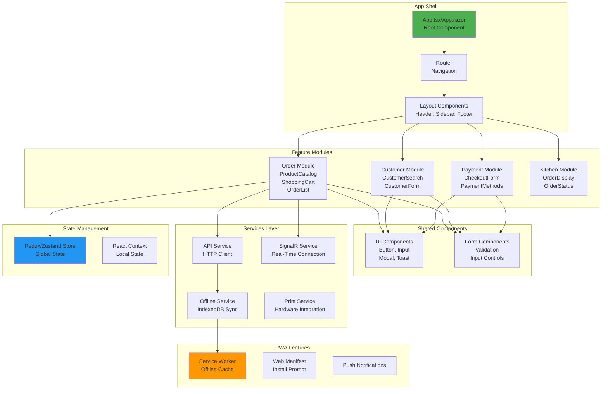
```mermaid
graph TB
    subgraph "App Shell"
        APP[App.tsx/App.razor<br/>Root Component]
        ROUTER[Router<br/>Navigation]
        LAYOUT[Layout Components<br/>Header, Sidebar, Footer]
    end
    
    subgraph "Feature Modules"
        ORDER_MOD[Order Module<br/>ProductCatalog<br/>ShoppingCart<br/>OrderList]
        CUSTOMER_MOD[Customer Module<br/>CustomerSearch<br/>CustomerForm]
        PAYMENT_MOD[Payment Module<br/>CheckoutForm<br/>PaymentMethods]
        KITCHEN_MOD[Kitchen Module<br/>OrderDisplay<br/>OrderStatus]
    end
    
    subgraph "Shared Components"
        UI_COMP[UI Components<br/>Button, Input<br/>Modal, Toast]
        FORMS[Form Components<br/>Validation<br/>Input Controls]
    end
    
    subgraph "Services Layer"
        API_SVC[API Service<br/>HTTP Client]
        SIGNALR_SVC[SignalR Service<br/>Real-Time Connection]
        OFFLINE_SVC[Offline Service<br/>IndexedDB Sync]
        PRINT_SVC[Print Service<br/>Hardware Integration]
    end
    
    subgraph "State Management"
        STORE[Redux/Zustand Store<br/>Global State]
        CONTEXT[React Context<br/>Local State]
    end
    
    subgraph "PWA Features"
        SW[Service Worker<br/>Offline Cache]
        MANIFEST[Web Manifest<br/>Install Prompt]
        PUSH[Push Notifications]
    end
    
    APP --> ROUTER
    ROUTER --> LAYOUT
    LAYOUT --> ORDER_MOD & CUSTOMER_MOD & PAYMENT_MOD & KITCHEN_MOD
    
    ORDER_MOD & CUSTOMER_MOD & PAYMENT_MOD --> UI_COMP
    ORDER_MOD & CUSTOMER_MOD & PAYMENT_MOD --> FORMS
    
    ORDER_MOD --> API_SVC
    ORDER_MOD --> SIGNALR_SVC
    ORDER_MOD --> STORE
    
    API_SVC --> OFFLINE_SVC
    OFFLINE_SVC --> SW
    
    style APP fill:#4CAF50
    style STORE fill:#2196F3
    style SW fill:#FF9800
```

### 7. SignalR Hub Architecture

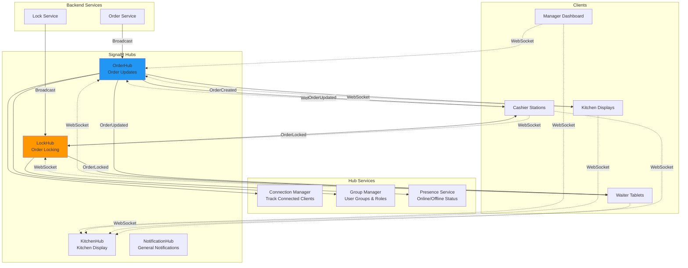
```mermaid
graph TB
    subgraph "SignalR Hubs"
        ORDER_HUB[OrderHub<br/>Order Updates]
        KITCHEN_HUB[KitchenHub<br/>Kitchen Display]
        LOCK_HUB[LockHub<br/>Order Locking]
        NOTIFY_HUB[NotificationHub<br/>General Notifications]
    end
    
    subgraph "Hub Services"
        CONNECTION_MGR[Connection Manager<br/>Track Connected Clients]
        GROUP_MGR[Group Manager<br/>User Groups & Roles]
        PRESENCE[Presence Service<br/>Online/Offline Status]
    end
    
    subgraph "Clients"
        CASHIER[Cashier Stations]
        WAITER[Waiter Tablets]
        KITCHEN[Kitchen Displays]
        MANAGER[Manager Dashboard]
    end
    
    subgraph "Backend Services"
        ORDER_SVC[Order Service]
        LOCK_SVC[Lock Service]
    end
    
    CASHIER & WAITER & KITCHEN & MANAGER -.->|WebSocket| ORDER_HUB
    CASHIER & WAITER & KITCHEN & MANAGER -.->|WebSocket| KITCHEN_HUB
    CASHIER & WAITER -.->|WebSocket| LOCK_HUB
    
    ORDER_HUB --> CONNECTION_MGR
    ORDER_HUB --> GROUP_MGR
    LOCK_HUB --> PRESENCE
    
    ORDER_SVC -->|Broadcast| ORDER_HUB
    LOCK_SVC -->|Broadcast| LOCK_HUB
    
    ORDER_HUB -->|OrderCreated| KITCHEN
    ORDER_HUB -->|OrderUpdated| CASHIER & WAITER
    LOCK_HUB -->|OrderLocked| CASHIER & WAITER
    
    style ORDER_HUB fill:#2196F3
    style LOCK_HUB fill:#FF9800
```

### 8. Print Server Architecture

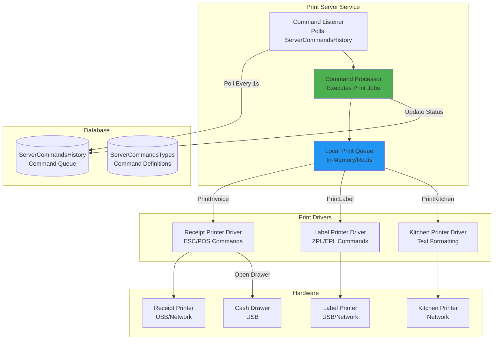
```mermaid
graph TB
    subgraph "Print Server Service"
        LISTENER[Command Listener<br/>Polls ServerCommandsHistory]
        PROCESSOR[Command Processor<br/>Executes Print Jobs]
        QUEUE[Local Print Queue<br/>In-Memory/Redis]
    end
    
    subgraph "Print Drivers"
        RECEIPT_DRV[Receipt Printer Driver<br/>ESC/POS Commands]
        LABEL_DRV[Label Printer Driver<br/>ZPL/EPL Commands]
        KITCHEN_DRV[Kitchen Printer Driver<br/>Text Formatting]
    end
    
    subgraph "Hardware"
        RECEIPT_HW[Receipt Printer<br/>USB/Network]
        LABEL_HW[Label Printer<br/>USB/Network]
        KITCHEN_HW[Kitchen Printer<br/>Network]
        DRAWER[Cash Drawer<br/>USB]
    end
    
    subgraph "Database"
        CMD_TABLE[(ServerCommandsHistory<br/>Command Queue)]
        CMD_TYPES[(ServerCommandsTypes<br/>Command Definitions)]
    end
    
    LISTENER -->|Poll Every 1s| CMD_TABLE
    LISTENER --> PROCESSOR
    PROCESSOR --> QUEUE
    
    QUEUE -->|PrintInvoice| RECEIPT_DRV
    QUEUE -->|PrintLabel| LABEL_DRV
    QUEUE -->|PrintKitchen| KITCHEN_DRV
    
    RECEIPT_DRV --> RECEIPT_HW
    LABEL_DRV --> LABEL_HW
    KITCHEN_DRV --> KITCHEN_HW
    
    RECEIPT_DRV -->|Open Drawer| DRAWER
    
    PROCESSOR -->|Update Status| CMD_TABLE
    
    style PROCESSOR fill:#4CAF50
    style QUEUE fill:#2196F3
```

---

## Data Flow Diagrams

### 9. Order Creation Flow

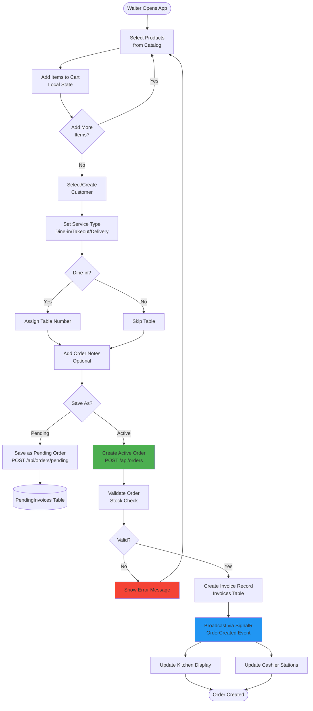
```mermaid
flowchart TD
    START([Waiter Opens App]) --> SELECT_PRODUCTS[Select Products<br/>from Catalog]
    SELECT_PRODUCTS --> ADD_TO_CART[Add Items to Cart<br/>Local State]
    ADD_TO_CART --> MORE{Add More<br/>Items?}
    MORE -->|Yes| SELECT_PRODUCTS
    MORE -->|No| SELECT_CUSTOMER[Select/Create<br/>Customer]
    
    SELECT_CUSTOMER --> SET_SERVICE[Set Service Type<br/>Dine-in/Takeout/Delivery]
    SET_SERVICE --> SET_TABLE{Dine-in?}
    SET_TABLE -->|Yes| ASSIGN_TABLE[Assign Table Number]
    SET_TABLE -->|No| SKIP_TABLE[Skip Table]
    
    ASSIGN_TABLE --> ADD_NOTES[Add Order Notes<br/>Optional]
    SKIP_TABLE --> ADD_NOTES
    
    ADD_NOTES --> SAVE_TYPE{Save As?}
    SAVE_TYPE -->|Pending| SAVE_PENDING[Save as Pending Order<br/>POST /api/orders/pending]
    SAVE_TYPE -->|Active| CREATE_ORDER[Create Active Order<br/>POST /api/orders]
    
    SAVE_PENDING --> PENDING_DB[(PendingInvoices Table)]
    CREATE_ORDER --> VALIDATE[Validate Order<br/>Stock Check]
    
    VALIDATE --> VALID{Valid?}
    VALID -->|No| ERROR[Show Error Message]
    VALID -->|Yes| CREATE_INVOICE[Create Invoice Record<br/>Invoices Table]
    
    CREATE_INVOICE --> BROADCAST[Broadcast via SignalR<br/>OrderCreated Event]
    BROADCAST --> KITCHEN[Update Kitchen Display]
    BROADCAST --> CASHIER[Update Cashier Stations]
    
    KITCHEN --> END([Order Created])
    CASHIER --> END
    ERROR --> SELECT_PRODUCTS
    
    style CREATE_ORDER fill:#4CAF50
    style BROADCAST fill:#2196F3
    style ERROR fill:#f44336
```

### 10. Pending Order Flow

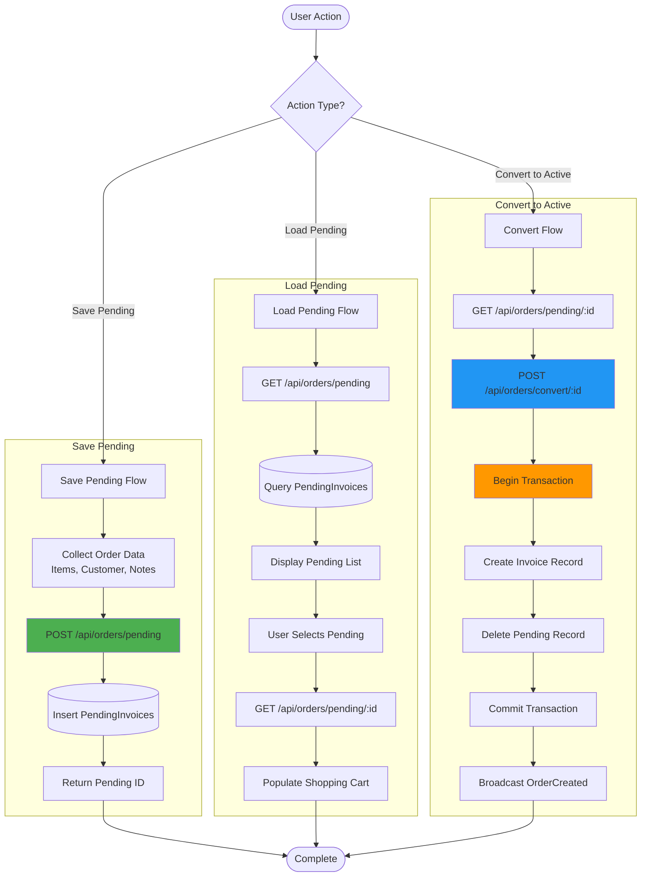
```mermaid
flowchart TD
    START([User Action]) --> ACTION{Action Type?}
    
    ACTION -->|Save Pending| SAVE_FLOW[Save Pending Flow]
    ACTION -->|Load Pending| LOAD_FLOW[Load Pending Flow]
    ACTION -->|Convert to Active| CONVERT_FLOW[Convert Flow]
    
    subgraph "Save Pending"
        SAVE_FLOW --> COLLECT_DATA[Collect Order Data<br/>Items, Customer, Notes]
        COLLECT_DATA --> SAVE_API[POST /api/orders/pending]
        SAVE_API --> SAVE_DB[(Insert PendingInvoices)]
        SAVE_DB --> SAVE_SUCCESS[Return Pending ID]
    end
    
    subgraph "Load Pending"
        LOAD_FLOW --> LIST_API[GET /api/orders/pending]
        LIST_API --> LOAD_DB[(Query PendingInvoices)]
        LOAD_DB --> DISPLAY_LIST[Display Pending List]
        DISPLAY_LIST --> SELECT_PENDING[User Selects Pending]
        SELECT_PENDING --> LOAD_DETAILS[GET /api/orders/pending/:id]
        LOAD_DETAILS --> POPULATE_CART[Populate Shopping Cart]
    end
    
    subgraph "Convert to Active"
        CONVERT_FLOW --> GET_PENDING[GET /api/orders/pending/:id]
        GET_PENDING --> CONVERT_API[POST /api/orders/convert/:id]
        CONVERT_API --> BEGIN_TXN[Begin Transaction]
        BEGIN_TXN --> CREATE_INVOICE[Create Invoice Record]
        CREATE_INVOICE --> DELETE_PENDING[Delete Pending Record]
        DELETE_PENDING --> COMMIT_TXN[Commit Transaction]
        COMMIT_TXN --> BROADCAST[Broadcast OrderCreated]
    end
    
    SAVE_SUCCESS --> END([Complete])
    POPULATE_CART --> END
    BROADCAST --> END
    
    style SAVE_API fill:#4CAF50
    style CONVERT_API fill:#2196F3
    style BEGIN_TXN fill:#FF9800
```

### 11. Payment Processing Flow

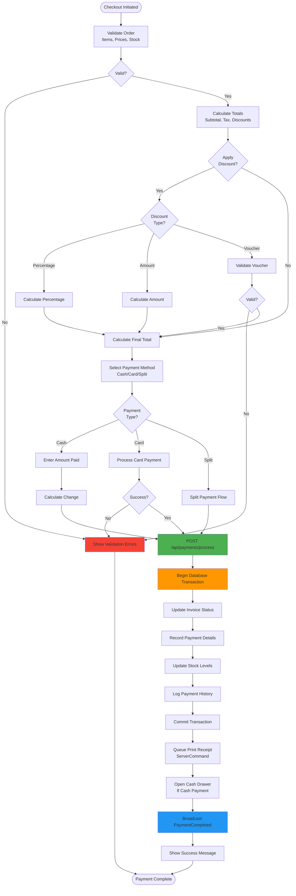
```mermaid
flowchart TD
    START([Checkout Initiated]) --> VALIDATE_ORDER[Validate Order<br/>Items, Prices, Stock]
    VALIDATE_ORDER --> VALID{Valid?}
    VALID -->|No| ERROR[Show Validation Errors]
    VALID -->|Yes| CALCULATE[Calculate Totals<br/>Subtotal, Tax, Discounts]
    
    CALCULATE --> APPLY_DISCOUNT{Apply<br/>Discount?}
    APPLY_DISCOUNT -->|Yes| DISCOUNT_TYPE{Discount<br/>Type?}
    DISCOUNT_TYPE -->|Percentage| CALC_PERCENT[Calculate Percentage]
    DISCOUNT_TYPE -->|Amount| CALC_AMOUNT[Calculate Amount]
    DISCOUNT_TYPE -->|Voucher| VALIDATE_VOUCHER[Validate Voucher]
    
    CALC_PERCENT --> FINAL_TOTAL[Calculate Final Total]
    CALC_AMOUNT --> FINAL_TOTAL
    VALIDATE_VOUCHER --> VOUCHER_VALID{Valid?}
    VOUCHER_VALID -->|No| ERROR
    VOUCHER_VALID -->|Yes| FINAL_TOTAL
    APPLY_DISCOUNT -->|No| FINAL_TOTAL
    
    FINAL_TOTAL --> SELECT_PAYMENT[Select Payment Method<br/>Cash/Card/Split]
    SELECT_PAYMENT --> PAYMENT_TYPE{Payment<br/>Type?}
    
    PAYMENT_TYPE -->|Cash| ENTER_AMOUNT[Enter Amount Paid]
    PAYMENT_TYPE -->|Card| PROCESS_CARD[Process Card Payment]
    PAYMENT_TYPE -->|Split| SPLIT_PAYMENT[Split Payment Flow]
    
    ENTER_AMOUNT --> CALC_CHANGE[Calculate Change]
    PROCESS_CARD --> CARD_SUCCESS{Success?}
    CARD_SUCCESS -->|No| ERROR
    CARD_SUCCESS -->|Yes| FINALIZE
    
    CALC_CHANGE --> FINALIZE[POST /api/payments/process]
    SPLIT_PAYMENT --> FINALIZE
    
    FINALIZE --> BEGIN_TXN[Begin Database Transaction]
    BEGIN_TXN --> UPDATE_INVOICE[Update Invoice Status]
    UPDATE_INVOICE --> RECORD_PAYMENT[Record Payment Details]
    RECORD_PAYMENT --> UPDATE_STOCK[Update Stock Levels]
    UPDATE_STOCK --> LOG_HISTORY[Log Payment History]
    LOG_HISTORY --> COMMIT_TXN[Commit Transaction]
    
    COMMIT_TXN --> PRINT_RECEIPT[Queue Print Receipt<br/>ServerCommand]
    PRINT_RECEIPT --> OPEN_DRAWER[Open Cash Drawer<br/>If Cash Payment]
    OPEN_DRAWER --> BROADCAST[Broadcast PaymentCompleted]
    
    BROADCAST --> SUCCESS[Show Success Message]
    SUCCESS --> END([Payment Complete])
    ERROR --> END
    
    style FINALIZE fill:#4CAF50
    style BEGIN_TXN fill:#FF9800
    style BROADCAST fill:#2196F3
    style ERROR fill:#f44336
```

### 12. Server Command Flow

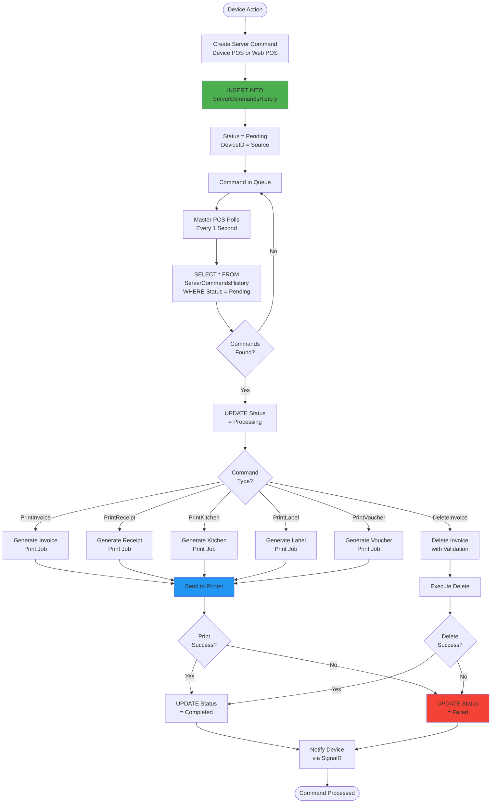
```mermaid
flowchart TD
    START([Device Action]) --> CREATE_CMD[Create Server Command<br/>Device POS or Web POS]
    CREATE_CMD --> INSERT_DB[INSERT INTO<br/>ServerCommandsHistory]
    INSERT_DB --> SET_STATUS[Status = Pending<br/>DeviceID = Source]
    
    SET_STATUS --> WAIT[Command in Queue]
    
    WAIT --> POLL[Master POS Polls<br/>Every 1 Second]
    POLL --> QUERY[SELECT * FROM<br/>ServerCommandsHistory<br/>WHERE Status = Pending]
    
    QUERY --> FOUND{Commands<br/>Found?}
    FOUND -->|No| WAIT
    FOUND -->|Yes| UPDATE_STATUS[UPDATE Status<br/>= Processing]
    
    UPDATE_STATUS --> CMD_TYPE{Command<br/>Type?}
    
    CMD_TYPE -->|PrintInvoice| PRINT_INV[Generate Invoice<br/>Print Job]
    CMD_TYPE -->|PrintReceipt| PRINT_REC[Generate Receipt<br/>Print Job]
    CMD_TYPE -->|PrintKitchen| PRINT_KITCHEN[Generate Kitchen<br/>Print Job]
    CMD_TYPE -->|PrintLabel| PRINT_LABEL[Generate Label<br/>Print Job]
    CMD_TYPE -->|DeleteInvoice| DELETE_INV[Delete Invoice<br/>with Validation]
    CMD_TYPE -->|PrintVoucher| PRINT_VOUCH[Generate Voucher<br/>Print Job]
    
    PRINT_INV --> SEND_PRINTER[Send to Printer]
    PRINT_REC --> SEND_PRINTER
    PRINT_KITCHEN --> SEND_PRINTER
    PRINT_LABEL --> SEND_PRINTER
    PRINT_VOUCH --> SEND_PRINTER
    DELETE_INV --> EXECUTE_DELETE[Execute Delete]
    
    SEND_PRINTER --> PRINT_SUCCESS{Print<br/>Success?}
    PRINT_SUCCESS -->|Yes| UPDATE_COMPLETE[UPDATE Status<br/>= Completed]
    PRINT_SUCCESS -->|No| UPDATE_FAILED[UPDATE Status<br/>= Failed]
    
    EXECUTE_DELETE --> DELETE_SUCCESS{Delete<br/>Success?}
    DELETE_SUCCESS -->|Yes| UPDATE_COMPLETE
    DELETE_SUCCESS -->|No| UPDATE_FAILED
    
    UPDATE_COMPLETE --> NOTIFY_DEVICE[Notify Device<br/>via SignalR]
    UPDATE_FAILED --> NOTIFY_DEVICE
    
    NOTIFY_DEVICE --> END([Command Processed])
    
    style INSERT_DB fill:#4CAF50
    style SEND_PRINTER fill:#2196F3
    style UPDATE_FAILED fill:#f44336
```

### 13. Real-Time Order Update Flow

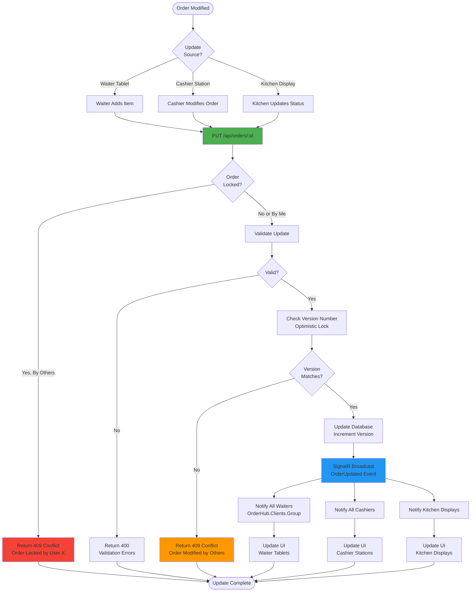
```mermaid
flowchart TD
    START([Order Modified]) --> SOURCE{Update<br/>Source?}
    
    SOURCE -->|Waiter Tablet| WAITER_UPDATE[Waiter Adds Item]
    SOURCE -->|Cashier Station| CASHIER_UPDATE[Cashier Modifies Order]
    SOURCE -->|Kitchen Display| KITCHEN_UPDATE[Kitchen Updates Status]
    
    WAITER_UPDATE --> API_CALL[PUT /api/orders/:id]
    CASHIER_UPDATE --> API_CALL
    KITCHEN_UPDATE --> API_CALL
    
    API_CALL --> CHECK_LOCK{Order<br/>Locked?}
    CHECK_LOCK -->|Yes, By Others| LOCK_ERROR[Return 409 Conflict<br/>Order Locked by User X]
    CHECK_LOCK -->|No or By Me| VALIDATE[Validate Update]
    
    VALIDATE --> VALID{Valid?}
    VALID -->|No| VALIDATION_ERROR[Return 400<br/>Validation Errors]
    VALID -->|Yes| CHECK_VERSION[Check Version Number<br/>Optimistic Lock]
    
    CHECK_VERSION --> VERSION_MATCH{Version<br/>Matches?}
    VERSION_MATCH -->|No| CONFLICT[Return 409 Conflict<br/>Order Modified by Others]
    VERSION_MATCH -->|Yes| UPDATE_DB[Update Database<br/>Increment Version]
    
    UPDATE_DB --> BROADCAST[SignalR Broadcast<br/>OrderUpdated Event]
    
    BROADCAST --> NOTIFY_WAITERS[Notify All Waiters<br/>OrderHub.Clients.Group]
    BROADCAST --> NOTIFY_CASHIERS[Notify All Cashiers]
    BROADCAST --> NOTIFY_KITCHEN[Notify Kitchen Displays]
    
    NOTIFY_WAITERS --> UPDATE_UI_W[Update UI<br/>Waiter Tablets]
    NOTIFY_CASHIERS --> UPDATE_UI_C[Update UI<br/>Cashier Stations]
    NOTIFY_KITCHEN --> UPDATE_UI_K[Update UI<br/>Kitchen Displays]
    
    UPDATE_UI_W --> END([Update Complete])
    UPDATE_UI_C --> END
    UPDATE_UI_K --> END
    
    LOCK_ERROR --> END
    VALIDATION_ERROR --> END
    CONFLICT --> END
    
    style API_CALL fill:#4CAF50
    style BROADCAST fill:#2196F3
    style LOCK_ERROR fill:#f44336
    style CONFLICT fill:#FF9800
```

---

## Sequence Diagrams

### 14. Complete Order Sequence

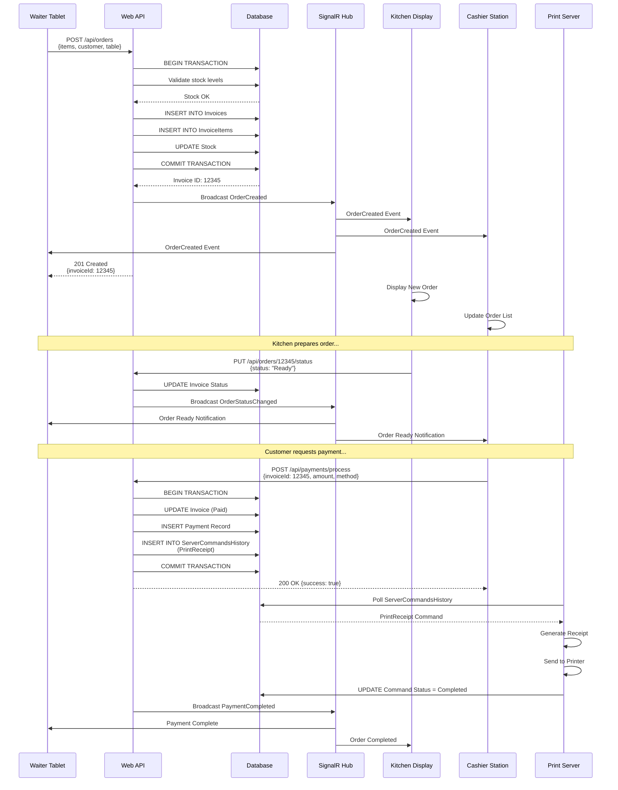
```mermaid
sequenceDiagram
    participant W as Waiter Tablet
    participant API as Web API
    participant DB as Database
    participant HUB as SignalR Hub
    participant K as Kitchen Display
    participant C as Cashier Station
    participant P as Print Server
    
    W->>API: POST /api/orders<br/>{items, customer, table}
    API->>DB: BEGIN TRANSACTION
    API->>DB: Validate stock levels
    DB-->>API: Stock OK
    API->>DB: INSERT INTO Invoices
    API->>DB: INSERT INTO InvoiceItems
    API->>DB: UPDATE Stock
    API->>DB: COMMIT TRANSACTION
    DB-->>API: Invoice ID: 12345
    
    API->>HUB: Broadcast OrderCreated
    HUB->>K: OrderCreated Event
    HUB->>C: OrderCreated Event
    HUB->>W: OrderCreated Event
    
    API-->>W: 201 Created<br/>{invoiceId: 12345}
    
    K->>K: Display New Order
    C->>C: Update Order List
    
    Note over W,P: Kitchen prepares order...
    
    K->>API: PUT /api/orders/12345/status<br/>{status: "Ready"}
    API->>DB: UPDATE Invoice Status
    API->>HUB: Broadcast OrderStatusChanged
    HUB->>W: Order Ready Notification
    HUB->>C: Order Ready Notification
    
    Note over W,P: Customer requests payment...
    
    C->>API: POST /api/payments/process<br/>{invoiceId: 12345, amount, method}
    API->>DB: BEGIN TRANSACTION
    API->>DB: UPDATE Invoice (Paid)
    API->>DB: INSERT Payment Record
    API->>DB: INSERT INTO ServerCommandsHistory<br/>(PrintReceipt)
    API->>DB: COMMIT TRANSACTION
    API-->>C: 200 OK {success: true}
    
    P->>DB: Poll ServerCommandsHistory
    DB-->>P: PrintReceipt Command
    P->>P: Generate Receipt
    P->>P: Send to Printer
    P->>DB: UPDATE Command Status = Completed
    
    API->>HUB: Broadcast PaymentCompleted
    HUB->>W: Payment Complete
    HUB->>K: Order Completed
```

### 15. Concurrent Order Editing Sequence

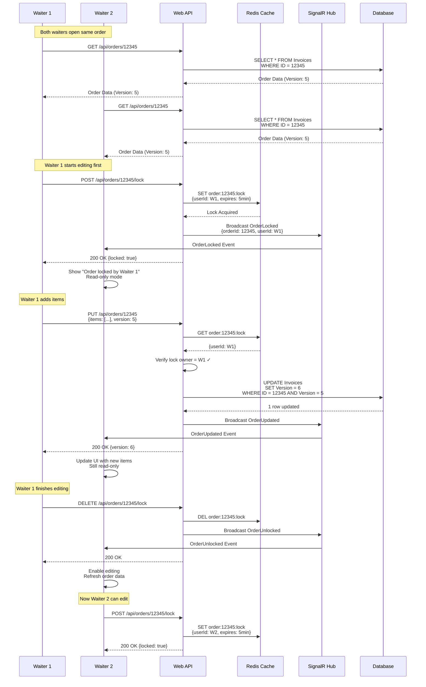
```mermaid
sequenceDiagram
    participant W1 as Waiter 1
    participant W2 as Waiter 2
    participant API as Web API
    participant REDIS as Redis Cache
    participant HUB as SignalR Hub
    participant DB as Database
    
    Note over W1,W2: Both waiters open same order
    
    W1->>API: GET /api/orders/12345
    API->>DB: SELECT * FROM Invoices<br/>WHERE ID = 12345
    DB-->>API: Order Data (Version: 5)
    API-->>W1: Order Data (Version: 5)
    
    W2->>API: GET /api/orders/12345
    API->>DB: SELECT * FROM Invoices<br/>WHERE ID = 12345
    DB-->>API: Order Data (Version: 5)
    API-->>W2: Order Data (Version: 5)
    
    Note over W1,W2: Waiter 1 starts editing first
    
    W1->>API: POST /api/orders/12345/lock
    API->>REDIS: SET order:12345:lock<br/>{userId: W1, expires: 5min}
    REDIS-->>API: Lock Acquired
    API->>HUB: Broadcast OrderLocked<br/>{orderId: 12345, userId: W1}
    HUB->>W2: OrderLocked Event
    API-->>W1: 200 OK {locked: true}
    
    W2->>W2: Show "Order locked by Waiter 1"<br/>Read-only mode
    
    Note over W1: Waiter 1 adds items
    
    W1->>API: PUT /api/orders/12345<br/>{items: [...], version: 5}
    API->>REDIS: GET order:12345:lock
    REDIS-->>API: {userId: W1}
    API->>API: Verify lock owner = W1 ✓
    API->>DB: UPDATE Invoices<br/>SET Version = 6<br/>WHERE ID = 12345 AND Version = 5
    DB-->>API: 1 row updated
    API->>HUB: Broadcast OrderUpdated
    HUB->>W2: OrderUpdated Event
    API-->>W1: 200 OK {version: 6}
    
    W2->>W2: Update UI with new items<br/>Still read-only
    
    Note over W1: Waiter 1 finishes editing
    
    W1->>API: DELETE /api/orders/12345/lock
    API->>REDIS: DEL order:12345:lock
    API->>HUB: Broadcast OrderUnlocked
    HUB->>W2: OrderUnlocked Event
    API-->>W1: 200 OK
    
    W2->>W2: Enable editing<br/>Refresh order data
    
    Note over W2: Now Waiter 2 can edit
    
    W2->>API: POST /api/orders/12345/lock
    API->>REDIS: SET order:12345:lock<br/>{userId: W2, expires: 5min}
    API-->>W2: 200 OK {locked: true}
```

### 16. Offline-to-Online Sync Sequence

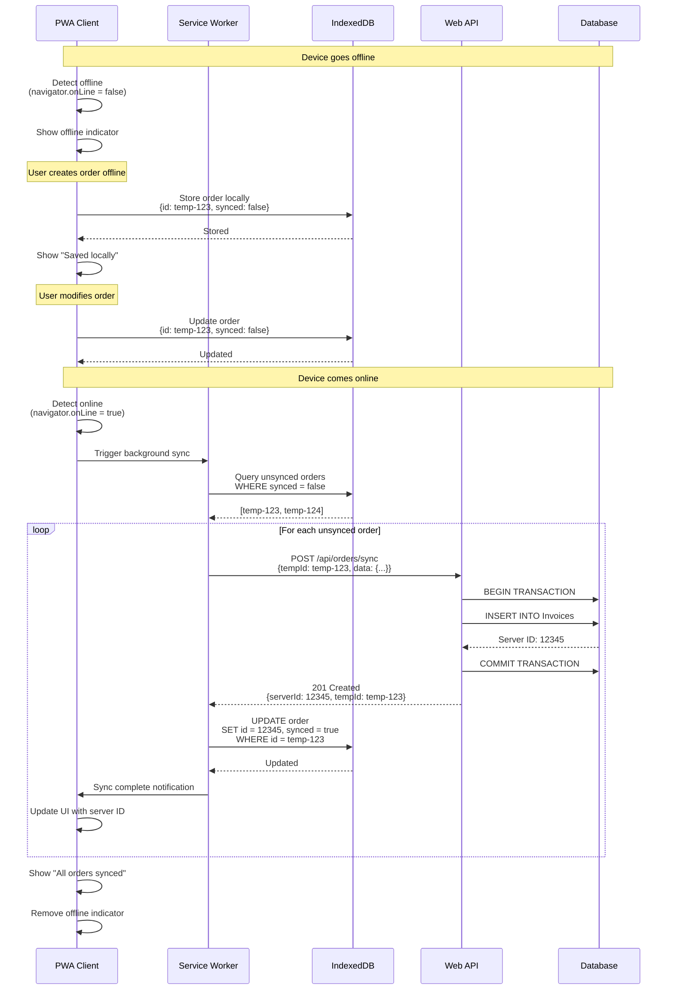
```mermaid
sequenceDiagram
    participant PWA as PWA Client
    participant SW as Service Worker
    participant IDB as IndexedDB
    participant API as Web API
    participant DB as Database
    
    Note over PWA,DB: Device goes offline
    
    PWA->>PWA: Detect offline<br/>(navigator.onLine = false)
    PWA->>PWA: Show offline indicator
    
    Note over PWA: User creates order offline
    
    PWA->>IDB: Store order locally<br/>{id: temp-123, synced: false}
    IDB-->>PWA: Stored
    PWA->>PWA: Show "Saved locally"
    
    Note over PWA: User modifies order
    
    PWA->>IDB: Update order<br/>{id: temp-123, synced: false}
    IDB-->>PWA: Updated
    
    Note over PWA,DB: Device comes online
    
    PWA->>PWA: Detect online<br/>(navigator.onLine = true)
    PWA->>SW: Trigger background sync
    
    SW->>IDB: Query unsynced orders<br/>WHERE synced = false
    IDB-->>SW: [temp-123, temp-124]
    
    loop For each unsynced order
        SW->>API: POST /api/orders/sync<br/>{tempId: temp-123, data: {...}}
        API->>DB: BEGIN TRANSACTION
        API->>DB: INSERT INTO Invoices
        DB-->>API: Server ID: 12345
        API->>DB: COMMIT TRANSACTION
        API-->>SW: 201 Created<br/>{serverId: 12345, tempId: temp-123}
        
        SW->>IDB: UPDATE order<br/>SET id = 12345, synced = true<br/>WHERE id = temp-123
        IDB-->>SW: Updated
        
        SW->>PWA: Sync complete notification
        PWA->>PWA: Update UI with server ID
    end
    
    PWA->>PWA: Show "All orders synced"
    PWA->>PWA: Remove offline indicator
```

### 17. Print Command Sequence

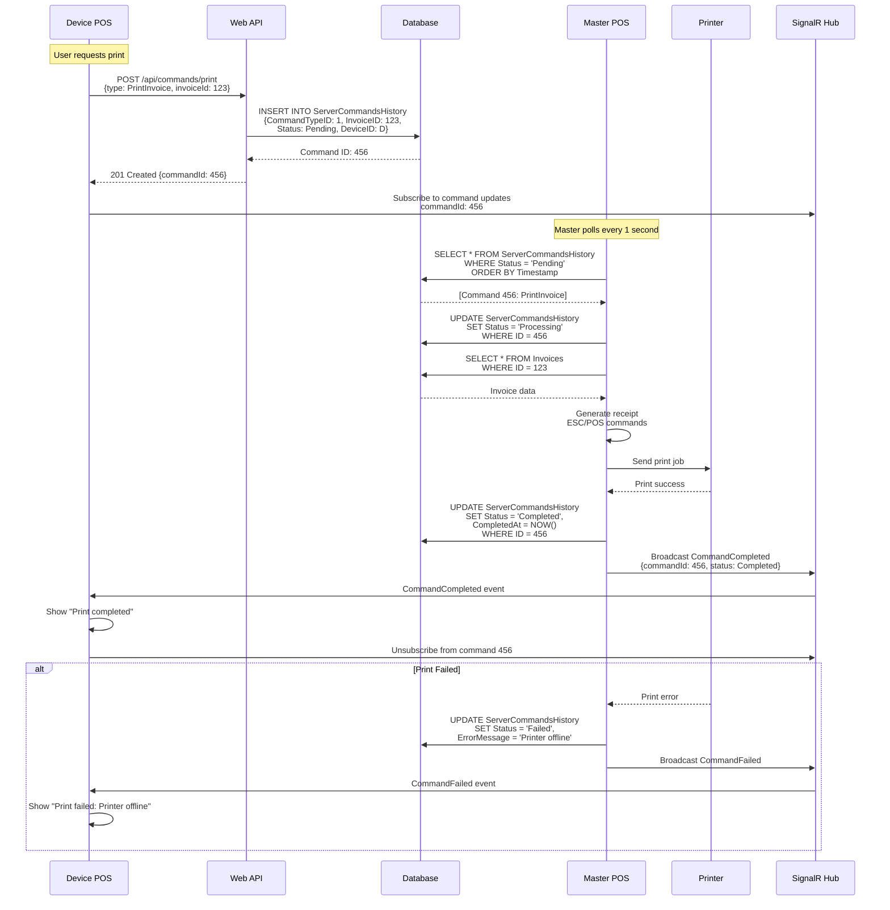
```mermaid
sequenceDiagram
    participant D as Device POS
    participant API as Web API
    participant DB as Database
    participant M as Master POS
    participant P as Printer
    participant HUB as SignalR Hub
    
    Note over D: User requests print
    
    D->>API: POST /api/commands/print<br/>{type: PrintInvoice, invoiceId: 123}
    API->>DB: INSERT INTO ServerCommandsHistory<br/>{CommandTypeID: 1, InvoiceID: 123,<br/>Status: Pending, DeviceID: D}
    DB-->>API: Command ID: 456
    API-->>D: 201 Created {commandId: 456}
    
    D->>HUB: Subscribe to command updates<br/>commandId: 456
    
    Note over M: Master polls every 1 second
    
    M->>DB: SELECT * FROM ServerCommandsHistory<br/>WHERE Status = 'Pending'<br/>ORDER BY Timestamp
    DB-->>M: [Command 456: PrintInvoice]
    
    M->>DB: UPDATE ServerCommandsHistory<br/>SET Status = 'Processing'<br/>WHERE ID = 456
    
    M->>DB: SELECT * FROM Invoices<br/>WHERE ID = 123
    DB-->>M: Invoice data
    
    M->>M: Generate receipt<br/>ESC/POS commands
    
    M->>P: Send print job
    P-->>M: Print success
    
    M->>DB: UPDATE ServerCommandsHistory<br/>SET Status = 'Completed',<br/>CompletedAt = NOW()<br/>WHERE ID = 456
    
    M->>HUB: Broadcast CommandCompleted<br/>{commandId: 456, status: Completed}
    HUB->>D: CommandCompleted event
    
    D->>D: Show "Print completed"
    D->>HUB: Unsubscribe from command 456
    
    alt Print Failed
        P-->>M: Print error
        M->>DB: UPDATE ServerCommandsHistory<br/>SET Status = 'Failed',<br/>ErrorMessage = 'Printer offline'
        M->>HUB: Broadcast CommandFailed
        HUB->>D: CommandFailed event
        D->>D: Show "Print failed: Printer offline"
    end
```

---

## State Diagrams

### 18. Order State Machine

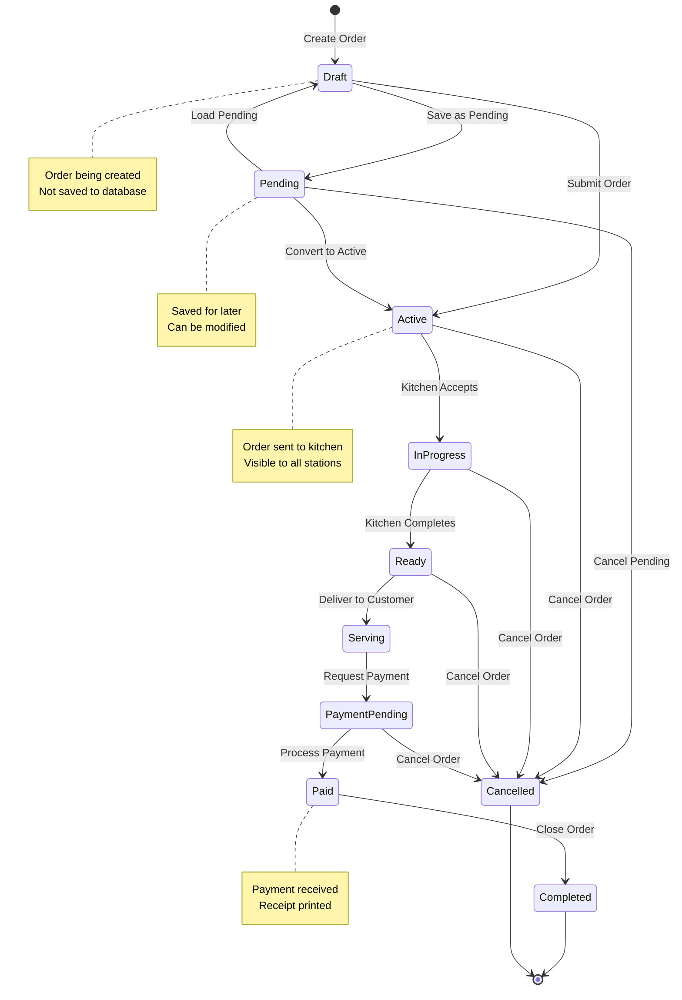
```mermaid
stateDiagram-v2
    [*] --> Draft: Create Order
    
    Draft --> Pending: Save as Pending
    Draft --> Active: Submit Order
    
    Pending --> Draft: Load Pending
    Pending --> Active: Convert to Active
    Pending --> Cancelled: Cancel Pending
    
    Active --> InProgress: Kitchen Accepts
    Active --> Cancelled: Cancel Order
    
    InProgress --> Ready: Kitchen Completes
    InProgress --> Cancelled: Cancel Order
    
    Ready --> Serving: Deliver to Customer
    Ready --> Cancelled: Cancel Order
    
    Serving --> PaymentPending: Request Payment
    
    PaymentPending --> Paid: Process Payment
    PaymentPending --> Cancelled: Cancel Order
    
    Paid --> Completed: Close Order
    
    Completed --> [*]
    Cancelled --> [*]
    
    note right of Draft
        Order being created
        Not saved to database
    end note
    
    note right of Pending
        Saved for later
        Can be modified
    end note
    
    note right of Active
        Order sent to kitchen
        Visible to all stations
    end note
    
    note right of Paid
        Payment received
        Receipt printed
    end note
```

### 19. Invoice State Machine

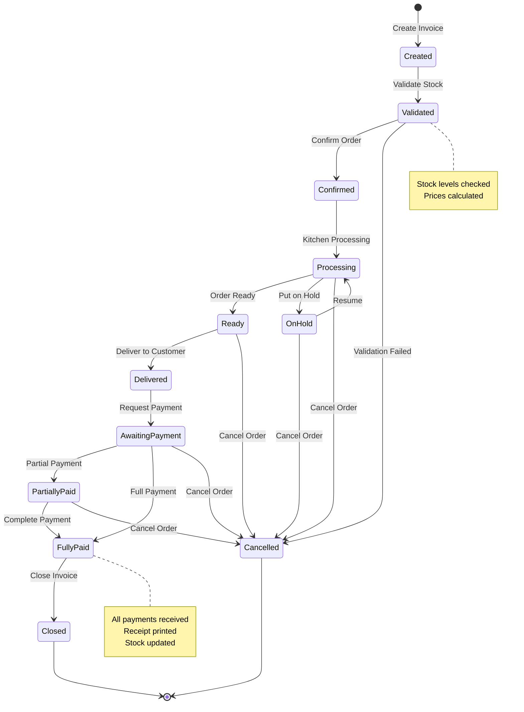
```mermaid
stateDiagram-v2
    [*] --> Created: Create Invoice
    
    Created --> Validated: Validate Stock
    
    Validated --> Confirmed: Confirm Order
    Validated --> Cancelled: Validation Failed
    
    Confirmed --> Processing: Kitchen Processing
    
    Processing --> Ready: Order Ready
    Processing --> OnHold: Put on Hold
    Processing --> Cancelled: Cancel Order
    
    OnHold --> Processing: Resume
    OnHold --> Cancelled: Cancel Order
    
    Ready --> Delivered: Deliver to Customer
    Ready --> Cancelled: Cancel Order
    
    Delivered --> AwaitingPayment: Request Payment
    
    AwaitingPayment --> PartiallyPaid: Partial Payment
    AwaitingPayment --> FullyPaid: Full Payment
    AwaitingPayment --> Cancelled: Cancel Order
    
    PartiallyPaid --> FullyPaid: Complete Payment
    PartiallyPaid --> Cancelled: Cancel Order
    
    FullyPaid --> Closed: Close Invoice
    
    Closed --> [*]
    Cancelled --> [*]
    
    note right of Validated
        Stock levels checked
        Prices calculated
    end note
    
    note right of FullyPaid
        All payments received
        Receipt printed
        Stock updated
    end note
```

### 20. Server Command State Machine

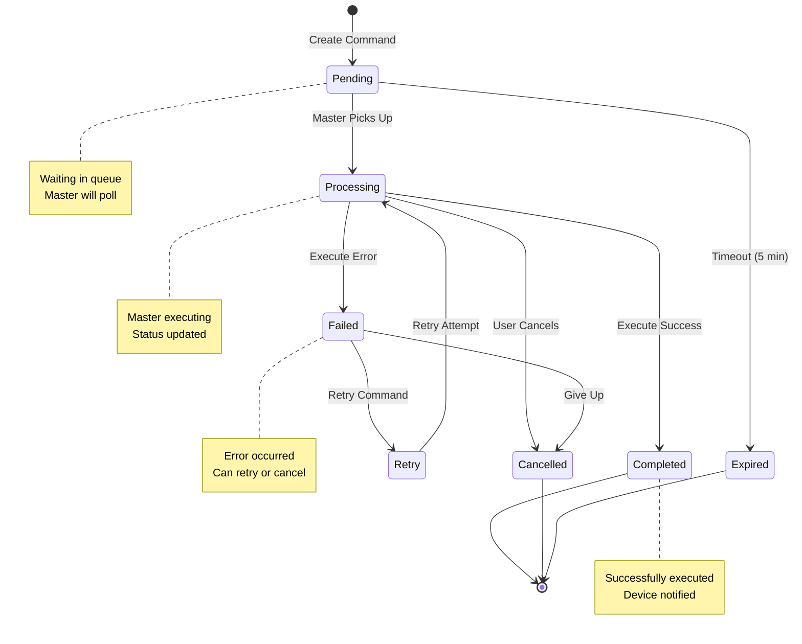
```mermaid
stateDiagram-v2
    [*] --> Pending: Create Command
    
    Pending --> Processing: Master Picks Up
    Pending --> Expired: Timeout (5 min)
    
    Processing --> Completed: Execute Success
    Processing --> Failed: Execute Error
    Processing --> Cancelled: User Cancels
    
    Failed --> Retry: Retry Command
    Failed --> Cancelled: Give Up
    
    Retry --> Processing: Retry Attempt
    
    Completed --> [*]
    Cancelled --> [*]
    Expired --> [*]
    
    note right of Pending
        Waiting in queue
        Master will poll
    end note
    
    note right of Processing
        Master executing
        Status updated
    end note
    
    note right of Failed
        Error occurred
        Can retry or cancel
    end note
    
    note right of Completed
        Successfully executed
        Device notified
    end note
```

---

## Database Diagrams

### 21. Core Database Schema

```mermaid
erDiagram
    Invoices ||--o{ InvoiceItems : contains
    Invoices ||--o{ Payments : has
    Invoices }o--|| Customers : "belongs to"
    Invoices }o--|| Users : "created by"
    Invoices }o--|| ServingTypes : "has type"
    
    InvoiceItems }o--|| CategoryItems : "is product"
    InvoiceItems ||--o{ InvoiceItemsExtras : "has extras"
    InvoiceItems ||--o{ InvoiceItemsFlavors : "has flavors"
    
    PendingInvoices ||--o{ PendingInvoiceItems : contains
    PendingInvoices }o--|| Customers : "belongs to"
    PendingInvoices }o--|| Users : "created by"
    
    Customers ||--o{ CustomerAddresses : "has addresses"
    CustomerAddresses }o--|| Addresses : references
    
    Invoices {
        int ID PK
        datetime TimeStamp
        int CustomerID FK
        int UserID FK
        byte ServingTypeID FK
        decimal TotalCost
        decimal CustomerPaid
        decimal Change
        byte TableNumber
        string InvoiceNote
        int Version
        datetime CreatedAt
        datetime UpdatedAt
    }
    
    InvoiceItems {
        int ID PK
        int InvoiceID FK
        int CategoryItemID FK
        decimal Quantity
        decimal Price
        decimal TotalCost
        string Notes
    }
    
    PendingInvoices {
        int ID PK
        datetime TimeStamp
        int CustomerID FK
        int UserID FK
        byte ServingTypeID FK
        decimal EstimatedTotal
        string Notes
        datetime CreatedAt
    }
    
    Customers {
        int ID PK
        string Name
        string Telephone
        string Email
        datetime CreatedAt
    }
    
    Payments {
        int ID PK
        int InvoiceID FK
        decimal Amount
        byte PaymentMethodID FK
        datetime PaymentTime
    }
```

### 22. Order Management Schema

```mermaid
erDiagram
    Orders ||--o{ OrderItems : contains
    Orders }o--|| OrderStatus : "has status"
    Orders }o--|| OrderSource : "from source"
    Orders ||--o{ OrderProgressHistory : "has history"
    
    OrderItems }o--|| Products : "is product"
    OrderItems ||--o{ OrderItemModifiers : "has modifiers"
    
    OrderProgressHistory }o--|| OrderProgressTypes : "progress type"
    OrderProgressHistory }o--|| Users : "updated by"
    
    Orders {
        int ID PK
        string OrderNumber
        int CustomerID FK
        int StatusID FK
        int SourceID FK
        decimal TotalAmount
        datetime OrderTime
        datetime EstimatedReady
        int Version
        boolean IsLocked
        int LockedByUserID FK
        datetime LockedAt
    }
    
    OrderItems {
        int ID PK
        int OrderID FK
        int ProductID FK
        decimal Quantity
        decimal UnitPrice
        decimal TotalPrice
        string SpecialInstructions
    }
    
    OrderProgressHistory {
        int ID PK
        int OrderID FK
        int ProgressTypeID FK
        int UserID FK
        datetime Timestamp
        string Notes
    }
    
    OrderStatus {
        int ID PK
        string Name
        string Description
    }
```

### 23. Command System Schema

```mermaid
erDiagram
    ServerCommandsHistory }o--|| ServerCommandsTypes : "command type"
    ServerCommandsHistory }o--|| Devices : "from device"
    ServerCommandsHistory }o--o| Invoices : "references"
    
    ServerCommandsHistory {
        int ID PK
        int CommandTypeID FK
        int DeviceID FK
        int InvoiceID FK
        string Status
        datetime CreatedAt
        datetime ProcessedAt
        datetime CompletedAt
        string ErrorMessage
        string Parameters
    }
    
    ServerCommandsTypes {
        int ID PK
        string Name
        string Description
    }
    
    Devices {
        int ID PK
        string DeviceName
        string DeviceType
        string IPAddress
        boolean IsActive
        datetime LastSeen
    }
```

---

## Concurrency & Queue Diagrams

### 24. Optimistic Locking Flow

```mermaid
flowchart TD
    START([User Modifies Order]) --> READ[Read Order from DB<br/>Current Version: 5]
    READ --> MODIFY[User Makes Changes<br/>in UI]
    MODIFY --> SUBMIT[Submit Changes<br/>PUT /api/orders/123]
    
    SUBMIT --> API[API Receives Request<br/>with Version: 5]
    API --> UPDATE[UPDATE Invoices<br/>SET ... , Version = 6<br/>WHERE ID = 123<br/>AND Version = 5]
    
    UPDATE --> CHECK{Rows<br/>Updated?}
    CHECK -->|1 row| SUCCESS[Update Successful<br/>Return Version 6]
    CHECK -->|0 rows| CONFLICT[Conflict Detected<br/>Order Modified by Others]
    
    CONFLICT --> FETCH[Fetch Latest Version<br/>from Database]
    FETCH --> MERGE{Auto<br/>Merge?}
    MERGE -->|Yes| AUTO_MERGE[Attempt Auto-Merge<br/>Non-conflicting Changes]
    MERGE -->|No| MANUAL[Show Conflict UI<br/>User Resolves Manually]
    
    AUTO_MERGE --> RETRY[Retry Update<br/>with New Version]
    MANUAL --> RETRY
    
    RETRY --> UPDATE
    
    SUCCESS --> BROADCAST[Broadcast Update<br/>via SignalR]
    BROADCAST --> END([Complete])
    
    style SUCCESS fill:#4CAF50
    style CONFLICT fill:#FF9800
```

### 25. Order Locking with SignalR

```mermaid
flowchart TD
    START([User Opens Order]) --> REQUEST_LOCK[Request Lock<br/>POST /api/orders/123/lock]
    REQUEST_LOCK --> CHECK_LOCK{Already<br/>Locked?}
    
    CHECK_LOCK -->|Yes| LOCKED_BY{Locked<br/>By Me?}
    LOCKED_BY -->|Yes| EXTEND_LOCK[Extend Lock TTL<br/>5 more minutes]
    LOCKED_BY -->|No| SHOW_LOCKED[Show "Locked by User X"<br/>Read-Only Mode]
    
    CHECK_LOCK -->|No| ACQUIRE_LOCK[Acquire Lock in Redis<br/>SET order:123:lock<br/>EX 300]
    ACQUIRE_LOCK --> BROADCAST_LOCK[Broadcast OrderLocked<br/>via SignalR]
    BROADCAST_LOCK --> ENABLE_EDIT[Enable Editing]
    
    EXTEND_LOCK --> ENABLE_EDIT
    
    ENABLE_EDIT --> HEARTBEAT[Start Heartbeat<br/>Every 60 seconds]
    HEARTBEAT --> KEEP_ALIVE[Extend Lock TTL<br/>EXPIRE order:123:lock 300]
    
    KEEP_ALIVE --> EDITING{Still<br/>Editing?}
    EDITING -->|Yes| HEARTBEAT
    EDITING -->|No| RELEASE_LOCK[Release Lock<br/>DEL order:123:lock]
    
    RELEASE_LOCK --> BROADCAST_UNLOCK[Broadcast OrderUnlocked<br/>via SignalR]
    BROADCAST_UNLOCK --> END([Lock Released])
    
    SHOW_LOCKED --> SUBSCRIBE[Subscribe to<br/>OrderUnlocked Event]
    SUBSCRIBE --> WAIT[Wait for Unlock]
    WAIT --> UNLOCKED{Order<br/>Unlocked?}
    UNLOCKED -->|Yes| REQUEST_LOCK
    UNLOCKED -->|No| WAIT
    
    style ACQUIRE_LOCK fill:#4CAF50
    style SHOW_LOCKED fill:#FF9800
```

### 26. RabbitMQ Command Queue

```mermaid
flowchart TD
    subgraph "Producers"
        WEB[Web POS Clients]
        DEVICE[Device POS]
        API[Web API]
    end
    
    subgraph "RabbitMQ"
        EXCHANGE[Commands Exchange<br/>Type: Topic]
        QUEUE_PRINT[Print Queue<br/>print.#]
        QUEUE_DELETE[Delete Queue<br/>delete.#]
        QUEUE_NOTIFY[Notify Queue<br/>notify.#]
    end
    
    subgraph "Consumers"
        PRINT_SVC[Print Service<br/>Worker]
        DELETE_SVC[Delete Service<br/>Worker]
        NOTIFY_SVC[Notification Service<br/>Worker]
    end
    
    WEB -->|Publish| API
    DEVICE -->|Publish| API
    API -->|print.invoice| EXCHANGE
    API -->|print.receipt| EXCHANGE
    API -->|delete.invoice| EXCHANGE
    API -->|notify.order| EXCHANGE
    
    EXCHANGE -->|Route| QUEUE_PRINT
    EXCHANGE -->|Route| QUEUE_DELETE
    EXCHANGE -->|Route| QUEUE_NOTIFY
    
    QUEUE_PRINT -->|Consume| PRINT_SVC
    QUEUE_DELETE -->|Consume| DELETE_SVC
    QUEUE_NOTIFY -->|Consume| NOTIFY_SVC
    
    PRINT_SVC -->|ACK/NACK| QUEUE_PRINT
    DELETE_SVC -->|ACK/NACK| QUEUE_DELETE
    NOTIFY_SVC -->|ACK/NACK| QUEUE_NOTIFY
    
    PRINT_SVC -->|Update Status| DB[(Database)]
    DELETE_SVC -->|Update Status| DB
    NOTIFY_SVC -->|Broadcast| HUB[SignalR Hub]
    
    style EXCHANGE fill:#FF9800
    style QUEUE_PRINT fill:#4CAF50
    style PRINT_SVC fill:#2196F3
```

### 27. Distributed Lock with Redis

```mermaid
flowchart TD
    START([Request Lock]) --> GENERATE[Generate Unique Lock ID<br/>lockId = UUID]
    GENERATE --> TRY_LOCK[Redis: SET order:123:lock<br/>lockId NX EX 300]
    
    TRY_LOCK --> ACQUIRED{Lock<br/>Acquired?}
    ACQUIRED -->|Yes| STORE_LOCAL[Store lockId Locally]
    ACQUIRED -->|No| WAIT[Wait 100ms]
    
    WAIT --> RETRY{Retry<br/>Count < 10?}
    RETRY -->|Yes| TRY_LOCK
    RETRY -->|No| FAIL[Return Lock Failed]
    
    STORE_LOCAL --> PERFORM[Perform Operations<br/>with Lock]
    PERFORM --> RELEASE[Release Lock<br/>Redis: DEL order:123:lock<br/>IF value = lockId]
    
    RELEASE --> VERIFY{Lock<br/>Released?}
    VERIFY -->|Yes| SUCCESS[Lock Released Successfully]
    VERIFY -->|No| EXPIRED[Lock Already Expired<br/>or Stolen]
    
    SUCCESS --> END([Complete])
    EXPIRED --> END
    FAIL --> END
    
    PERFORM -.->|Timeout| AUTO_EXPIRE[Lock Auto-Expires<br/>After 5 Minutes]
    AUTO_EXPIRE -.-> EXPIRED
    
    style STORE_LOCAL fill:#4CAF50
    style FAIL fill:#f44336
    style EXPIRED fill:#FF9800
```

---

## User Journey Diagrams

### 28. Cashier Journey

```mermaid
journey
    title Cashier Taking Order at Counter
    section Order Entry
      Open POS App: 5: Cashier
      Browse Products: 4: Cashier
      Add Items to Cart: 5: Cashier
      Apply Modifiers: 4: Cashier
      Add Special Instructions: 3: Cashier
    section Customer Info
      Search Customer: 4: Cashier
      Select Existing Customer: 5: Cashier
      Create New Customer: 3: Cashier
    section Service Type
      Select Dine-in: 5: Cashier
      Assign Table Number: 4: Cashier
    section Review
      Review Order: 5: Cashier
      Apply Discount: 3: Cashier
      Add Order Notes: 3: Cashier
    section Payment
      Select Payment Method: 5: Cashier
      Process Cash Payment: 5: Cashier
      Calculate Change: 5: Cashier
      Open Cash Drawer: 5: Cashier
      Print Receipt: 4: Cashier
    section Complete
      Hand Receipt to Customer: 5: Cashier
      Close Order: 5: Cashier
```

### 29. Waiter Journey

```mermaid
journey
    title Waiter Taking Order with Tablet
    section Approach Table
      Greet Customer: 5: Waiter
      Open POS App on Tablet: 5: Waiter
      Select Table Number: 5: Waiter
    section Take Order
      Show Menu to Customer: 4: Waiter
      Add Items to Order: 5: Waiter
      Customize Items: 4: Waiter
      Add Special Requests: 4: Waiter
      Confirm Order with Customer: 5: Waiter
    section Submit
      Review Order Summary: 5: Waiter
      Submit to Kitchen: 5: Waiter
      Receive Confirmation: 5: Waiter
    section Monitor
      Check Order Status: 4: Waiter
      Receive "Ready" Notification: 5: Waiter
    section Serve
      Collect Order from Kitchen: 4: Waiter
      Deliver to Table: 5: Waiter
    section Payment
      Customer Requests Bill: 5: Waiter
      Navigate to Cashier: 3: Waiter
      Process Payment at Counter: 4: Cashier
    section Complete
      Thank Customer: 5: Waiter
      Clear Table Status: 4: Waiter
```

### 30. Kitchen Staff Journey

```mermaid
journey
    title Kitchen Staff Processing Orders
    section Receive Order
      New Order Notification: 5: Kitchen
      View Order on Display: 5: Kitchen
      Read Order Details: 5: Kitchen
      Check Ingredients: 4: Kitchen
    section Prepare
      Accept Order: 5: Kitchen
      Start Preparation: 5: Kitchen
      Follow Recipe: 4: Kitchen
      Plate Food: 5: Kitchen
    section Quality Check
      Review Presentation: 4: Kitchen
      Verify Order Completeness: 5: Kitchen
      Mark Order as Ready: 5: Kitchen
    section Handoff
      Place on Pickup Counter: 5: Kitchen
      Notify Waiter: 5: Kitchen
      Wait for Pickup: 3: Kitchen
      Confirm Pickup: 5: Kitchen
    section Monitor
      Check Pending Orders: 4: Kitchen
      Prioritize Rush Orders: 4: Kitchen
      Update Estimated Times: 3: Kitchen
```

### 31. Manager Journey

```mermaid
journey
    title Manager Monitoring Operations
    section Morning Setup
      Open Manager Dashboard: 5: Manager
      Review Yesterday's Sales: 4: Manager
      Check Stock Levels: 4: Manager
      Review Staff Schedule: 4: Manager
    section Monitor Operations
      View Real-Time Orders: 5: Manager
      Check Kitchen Performance: 4: Manager
      Monitor Wait Times: 4: Manager
      Review Customer Feedback: 3: Manager
    section Handle Issues
      Receive Alert: Low Stock: 3: Manager
      Check Inventory: 4: Manager
      Place Supplier Order: 3: Manager
    section Reports
      Generate Sales Report: 4: Manager
      Analyze Popular Items: 5: Manager
      Review Staff Performance: 4: Manager
      Export Data for Accounting: 3: Manager
    section End of Day
      Review Daily Summary: 5: Manager
      Close Cash Registers: 4: Manager
      Prepare Bank Deposit: 4: Manager
      Lock System: 5: Manager
```

---

## Deployment Diagrams

### 32. On-Premises Deployment

```mermaid
graph TB
    subgraph "Physical Server - Windows Server 2019+"
        subgraph "IIS / Kestrel"
            WEB_APP[ASP.NET Core Web App<br/>Port 443 HTTPS]
            API_APP[ASP.NET Core API<br/>Port 5001]
            SIGNALR_APP[SignalR Hub<br/>WebSocket]
        end
        
        subgraph "Background Services"
            PRINT_SVC[Print Service<br/>Windows Service]
            SYNC_SVC[Sync Service<br/>Optional Cloud Sync]
        end
        
        subgraph "Data Services"
            SQL[SQL Server 2019<br/>Port 1433]
            REDIS[Redis 7.x<br/>Port 6379]
            RABBIT[RabbitMQ 3.x<br/>Port 5672]
        end
        
        subgraph "File System"
            LOGS[Logs Directory<br/>C:\POS\Logs]
            RECEIPTS[Receipts Archive<br/>C:\POS\Receipts]
            BACKUPS[Database Backups<br/>C:\POS\Backups]
        end
    end
    
    subgraph "Network Devices"
        STATIONS[POS Stations<br/>Windows/Tablets]
        TABLETS[Waiter Tablets<br/>iOS/Android]
        KITCHEN[Kitchen Displays<br/>Tablets/Monitors]
        PRINTERS[Network Printers<br/>Receipt/Kitchen/Label]
    end
    
    STATIONS -->|HTTPS| WEB_APP
    TABLETS -->|HTTPS| WEB_APP
    KITCHEN -->|HTTPS| WEB_APP
    
    WEB_APP --> API_APP
    API_APP --> SQL
    API_APP --> REDIS
    API_APP --> RABBIT
    
    SIGNALR_APP --> REDIS
    
    PRINT_SVC --> RABBIT
    PRINT_SVC --> PRINTERS
    PRINT_SVC --> SQL
    
    API_APP --> LOGS
    API_APP --> RECEIPTS
    
    SQL --> BACKUPS
    
    style WEB_APP fill:#4CAF50
    style SQL fill:#FF9800
    style REDIS fill:#2196F3
```

### 33. Cloud-Hybrid Deployment

```mermaid
graph TB
    subgraph "On-Premises - Branch 1"
        LOCAL_API_1[Local API Server]
        LOCAL_DB_1[(Local SQL Server)]
        LOCAL_DEVICES_1[POS Devices]
    end
    
    subgraph "On-Premises - Branch 2"
        LOCAL_API_2[Local API Server]
        LOCAL_DB_2[(Local SQL Server)]
        LOCAL_DEVICES_2[POS Devices]
    end
    
    subgraph "Cloud - Azure"
        subgraph "App Services"
            CLOUD_API[Central API<br/>App Service]
            CLOUD_HUB[SignalR Service<br/>Azure SignalR]
        end
        
        subgraph "Data Services"
            CLOUD_DB[(Azure SQL Database<br/>Central Data)]
            CLOUD_STORAGE[Blob Storage<br/>Receipts & Reports]
            CLOUD_CACHE[Azure Cache for Redis]
        end
        
        subgraph "Analytics"
            ANALYTICS[Application Insights]
            POWERBI[Power BI<br/>Dashboards]
        end
    end
    
    subgraph "Management"
        OWNER[Owner Dashboard<br/>Any Device]
        ADMIN[Admin Portal<br/>Web Browser]
    end
    
    LOCAL_DEVICES_1 --> LOCAL_API_1
    LOCAL_API_1 --> LOCAL_DB_1
    
    LOCAL_DEVICES_2 --> LOCAL_API_2
    LOCAL_API_2 --> LOCAL_DB_2
    
    LOCAL_API_1 -.->|Sync Every 5 min| CLOUD_API
    LOCAL_API_2 -.->|Sync Every 5 min| CLOUD_API
    
    CLOUD_API --> CLOUD_DB
    CLOUD_API --> CLOUD_STORAGE
    CLOUD_API --> CLOUD_CACHE
    CLOUD_API --> ANALYTICS
    
    OWNER --> CLOUD_API
    ADMIN --> CLOUD_API
    
    CLOUD_DB --> POWERBI
    ANALYTICS --> POWERBI
    
    CLOUD_HUB -.->|Real-Time| LOCAL_API_1
    CLOUD_HUB -.->|Real-Time| LOCAL_API_2
    
    style LOCAL_API_1 fill:#4CAF50
    style CLOUD_API fill:#2196F3
    style CLOUD_DB fill:#FF9800
```

### 34. Multi-Branch Deployment

```mermaid
graph TB
    subgraph "Branch A - Downtown"
        BRANCH_A_SERVER[Local Server<br/>192.168.1.100]
        BRANCH_A_DB[(SQL Server)]
        BRANCH_A_DEVICES[5 POS Stations<br/>3 Tablets]
    end
    
    subgraph "Branch B - Mall"
        BRANCH_B_SERVER[Local Server<br/>192.168.2.100]
        BRANCH_B_DB[(SQL Server)]
        BRANCH_B_DEVICES[8 POS Stations<br/>5 Tablets]
    end
    
    subgraph "Branch C - Airport"
        BRANCH_C_SERVER[Local Server<br/>192.168.3.100]
        BRANCH_C_DB[(SQL Server)]
        BRANCH_C_DEVICES[4 POS Stations<br/>2 Tablets]
    end
    
    subgraph "Head Office"
        HQ_SERVER[Central Server]
        HQ_DB[(Central Database<br/>Aggregated Data)]
        HQ_BACKUP[(Backup Server)]
    end
    
    BRANCH_A_DEVICES --> BRANCH_A_SERVER
    BRANCH_A_SERVER --> BRANCH_A_DB
    
    BRANCH_B_DEVICES --> BRANCH_B_SERVER
    BRANCH_B_SERVER --> BRANCH_B_DB
    
    BRANCH_C_DEVICES --> BRANCH_C_SERVER
    BRANCH_C_SERVER --> BRANCH_C_DB
    
    BRANCH_A_SERVER -.->|VPN Sync| HQ_SERVER
    BRANCH_B_SERVER -.->|VPN Sync| HQ_SERVER
    BRANCH_C_SERVER -.->|VPN Sync| HQ_SERVER
    
    HQ_SERVER --> HQ_DB
    HQ_DB -.->|Nightly Backup| HQ_BACKUP
    
    OWNER[Owner<br/>Mobile App] --> HQ_SERVER
    MANAGER[Regional Manager<br/>Dashboard] --> HQ_SERVER
    
    style BRANCH_A_SERVER fill:#4CAF50
    style BRANCH_B_SERVER fill:#4CAF50
    style BRANCH_C_SERVER fill:#4CAF50
    style HQ_SERVER fill:#2196F3
```

---

## Migration Diagrams

### 35. Phase 1: Backend API (Months 1-6)

```mermaid
graph TB
    subgraph "Current State"
        WPF_OLD[WPF POS<br/>Direct DB Access]
        DB_OLD[(SQL Server<br/>Existing Schema)]
    end
    
    subgraph "Phase 1: Build API"
        API_NEW[ASP.NET Core API<br/>New Backend]
        REPOS[Repository Layer<br/>EF Core]
        SERVICES[Service Layer<br/>Business Logic]
    end
    
    subgraph "Testing"
        POSTMAN[Postman Tests<br/>API Validation]
        UNIT_TESTS[Unit Tests<br/>xUnit]
    end
    
    WPF_OLD --> DB_OLD
    
    API_NEW --> REPOS
    REPOS --> DB_OLD
    SERVICES --> REPOS
    
    POSTMAN -.->|Test| API_NEW
    UNIT_TESTS -.->|Test| SERVICES
    
    WPF_OLD -.->|Can Start Using| API_NEW
    
    style API_NEW fill:#4CAF50
    style WPF_OLD fill:#9E9E9E
```

### 36. Phase 2: Web POS MVP (Months 7-12)

```mermaid
graph TB
    subgraph "Frontend"
        PWA[React/Blazor PWA<br/>Core Features Only]
        SW[Service Worker<br/>Offline Support]
    end
    
    subgraph "Backend"
        API[ASP.NET Core API<br/>From Phase 1]
        HUB[SignalR Hub<br/>Real-Time]
    end
    
    subgraph "Current System"
        WPF[WPF POS<br/>Still Primary]
    end
    
    subgraph "Database"
        DB[(SQL Server<br/>Shared)]
    end
    
    PWA -->|REST| API
    PWA -.->|WebSocket| HUB
    PWA --> SW
    
    API --> DB
    HUB --> DB
    WPF --> DB
    
    WPF -.->|Can Use| API
    
    TESTING[Testing on<br/>Secondary Stations]
    TESTING -.-> PWA
    
    style PWA fill:#4CAF50
    style WPF fill:#9E9E9E
```

### 37. Phase 3: Parallel Run (Months 13-18)

```mermaid
graph TB
    subgraph "Web POS - Testing"
        WEB_STATIONS[2-3 Stations<br/>Web POS]
        WEB_TABLETS[Waiter Tablets<br/>Web POS]
    end
    
    subgraph "WPF POS - Primary"
        WPF_STATIONS[5-6 Stations<br/>WPF POS]
        WPF_MASTER[Master Station<br/>WPF POS]
    end
    
    subgraph "Shared Backend"
        API[Unified API<br/>Serves Both]
        HUB[SignalR Hub<br/>Real-Time Sync]
    end
    
    subgraph "Database"
        DB[(SQL Server<br/>Single Source of Truth)]
    end
    
    WEB_STATIONS --> API
    WEB_TABLETS --> API
    WEB_STATIONS -.-> HUB
    WEB_TABLETS -.-> HUB
    
    WPF_STATIONS --> API
    WPF_MASTER --> API
    WPF_MASTER --> DB
    
    API --> DB
    HUB --> DB
    
    MONITOR[Monitoring<br/>Compare Performance]
    MONITOR -.-> WEB_STATIONS
    MONITOR -.-> WPF_STATIONS
    
    style WEB_STATIONS fill:#4CAF50
    style WPF_STATIONS fill:#9E9E9E
```

### 38. Phase 4: Full Migration (Months 19-24)

```mermaid
graph TB
    subgraph "Web POS - Primary"
        WEB_ALL[All Stations<br/>Web POS]
        WEB_TABLETS[All Tablets<br/>Web POS]
        WEB_KITCHEN[Kitchen Displays<br/>Web POS]
    end
    
    subgraph "WPF POS - Backup"
        WPF_BACKUP[1 Backup Station<br/>WPF POS<br/>Emergency Only]
    end
    
    subgraph "Backend"
        API[ASP.NET Core API<br/>Production]
        HUB[SignalR Hub]
        PRINT[Print Service]
    end
    
    subgraph "Database"
        DB[(SQL Server)]
    end
    
    WEB_ALL --> API
    WEB_TABLETS --> API
    WEB_KITCHEN --> API
    
    WEB_ALL -.-> HUB
    WEB_TABLETS -.-> HUB
    WEB_KITCHEN -.-> HUB
    
    WPF_BACKUP -.->|Rarely Used| API
    
    API --> DB
    HUB --> DB
    PRINT --> DB
    
    DEPRECATE[Deprecation Plan<br/>Remove WPF in 6 months]
    DEPRECATE -.-> WPF_BACKUP
    
    style WEB_ALL fill:#4CAF50
    style WPF_BACKUP fill:#9E9E9E
```

---

## Integration Diagrams

### 39. Hardware Integration

```mermaid
graph TB
    subgraph "Web POS Client"
        PWA[PWA Application]
        PRINT_CLIENT[Print Client Module]
    end
    
    subgraph "Print Server"
        PRINT_SVC[Print Service<br/>Windows Service]
        DRIVER_MGR[Driver Manager]
    end
    
    subgraph "Drivers"
        ESC_POS[ESC/POS Driver<br/>Receipt Printers]
        ZPL[ZPL Driver<br/>Label Printers]
        RAW[Raw Driver<br/>Kitchen Printers]
    end
    
    subgraph "Hardware"
        RECEIPT[Receipt Printer<br/>Epson TM-T88]
        LABEL[Label Printer<br/>Zebra ZD420]
        KITCHEN[Kitchen Printer<br/>Star TSP100]
        DRAWER[Cash Drawer<br/>APG Vasario]
        SCANNER[Barcode Scanner<br/>Honeywell]
        SCALE[Scale<br/>Mettler Toledo]
    end
    
    PWA -->|Print Command| PRINT_CLIENT
    PRINT_CLIENT -->|HTTP/WebSocket| PRINT_SVC
    
    PRINT_SVC --> DRIVER_MGR
    DRIVER_MGR --> ESC_POS
    DRIVER_MGR --> ZPL
    DRIVER_MGR --> RAW
    
    ESC_POS -->|USB/Network| RECEIPT
    ZPL -->|USB/Network| LABEL
    RAW -->|Network| KITCHEN
    
    ESC_POS -->|Pulse Signal| DRAWER
    
    SCANNER -->|USB HID| PWA
    SCALE -->|USB Serial| PWA
    
    style PRINT_SVC fill:#4CAF50
    style DRIVER_MGR fill:#2196F3
```

### 40. Third-Party Integration

```mermaid
graph TB
    subgraph "POS System"
        API[POS API]
        WEBHOOK[Webhook Handler]
    end
    
    subgraph "Payment Gateways"
        STRIPE[Stripe<br/>Card Payments]
        PAYPAL[PayPal<br/>Online Payments]
        SQUARE[Square<br/>Terminal]
    end
    
    subgraph "Delivery Platforms"
        UBER[Uber Eats<br/>API Integration]
        DELIVEROO[Deliveroo<br/>API Integration]
        GLOVO[Glovo<br/>API Integration]
    end
    
    subgraph "Accounting"
        QUICKBOOKS[QuickBooks<br/>API]
        XERO[Xero<br/>API]
    end
    
    subgraph "Loyalty"
        LOYALTY_API[Loyalty Program<br/>Custom API]
        SMS[SMS Gateway<br/>Twilio]
    end
    
    API -->|Process Payment| STRIPE
    API -->|Process Payment| PAYPAL
    API -->|Process Payment| SQUARE
    
    UBER -->|New Order| WEBHOOK
    DELIVEROO -->|New Order| WEBHOOK
    GLOVO -->|New Order| WEBHOOK
    
    WEBHOOK --> API
    
    API -->|Export Transactions| QUICKBOOKS
    API -->|Export Transactions| XERO
    
    API -->|Points Update| LOYALTY_API
    API -->|Send Notification| SMS
    
    style API fill:#4CAF50
    style WEBHOOK fill:#2196F3
```

### 41. Legacy System Integration

```mermaid
graph TB
    subgraph "New Web POS"
        WEB_CLIENT[Web PWA Client]
        NEW_API[New ASP.NET Core API]
    end
    
    subgraph "Legacy WPF POS"
        WPF_CLIENT[WPF Application]
        WPF_LOGIC[Business Logic]
    end
    
    subgraph "Integration Layer"
        ADAPTER[API Adapter<br/>Compatibility Layer]
        TRANSLATOR[Data Translator<br/>DTO Mapping]
    end
    
    subgraph "Shared Database"
        DB[(SQL Server<br/>Existing Schema)]
    end
    
    WEB_CLIENT -->|REST API| NEW_API
    NEW_API --> ADAPTER
    ADAPTER --> TRANSLATOR
    TRANSLATOR --> DB
    
    WPF_CLIENT --> WPF_LOGIC
    WPF_LOGIC -->|Can Use| ADAPTER
    WPF_LOGIC -->|Direct Access| DB
    
    NEW_API -.->|Read| DB
    
    SYNC[Sync Service<br/>Ensures Consistency]
    SYNC --> DB
    
    style NEW_API fill:#4CAF50
    style WPF_LOGIC fill:#9E9E9E
    style ADAPTER fill:#2196F3
```

---

## Security Diagrams

### 42. Authentication Flow

```mermaid
sequenceDiagram
    participant U as User
    participant PWA as PWA Client
    participant API as Web API
    participant AUTH as Auth Service
    participant DB as Database
    participant CACHE as Redis Cache
    
    U->>PWA: Enter Credentials
    PWA->>API: POST /api/auth/login<br/>{username, password}
    API->>AUTH: Validate Credentials
    AUTH->>DB: Query Users Table
    DB-->>AUTH: User Record
    AUTH->>AUTH: Verify Password Hash
    
    alt Valid Credentials
        AUTH->>AUTH: Generate JWT Token<br/>+ Refresh Token
        AUTH->>CACHE: Store Refresh Token<br/>TTL: 7 days
        AUTH-->>API: Tokens
        API-->>PWA: 200 OK<br/>{accessToken, refreshToken}
        PWA->>PWA: Store Tokens<br/>in LocalStorage
        PWA->>PWA: Set Authorization Header
    else Invalid Credentials
        AUTH-->>API: Invalid
        API-->>PWA: 401 Unauthorized
        PWA->>U: Show Error Message
    end
    
    Note over PWA,API: Subsequent Requests
    
    PWA->>API: GET /api/orders<br/>Authorization: Bearer {token}
    API->>API: Validate JWT Token
    
    alt Token Valid
        API->>DB: Execute Query
        DB-->>API: Data
        API-->>PWA: 200 OK {data}
    else Token Expired
        API-->>PWA: 401 Unauthorized
        PWA->>API: POST /api/auth/refresh<br/>{refreshToken}
        API->>CACHE: Validate Refresh Token
        CACHE-->>API: Valid
        API->>API: Generate New Access Token
        API-->>PWA: 200 OK {newAccessToken}
        PWA->>API: Retry Original Request
    end
```

### 43. Authorization Model

```mermaid
graph TB
    subgraph "Users"
        CASHIER[Cashier User]
        WAITER[Waiter User]
        KITCHEN[Kitchen User]
        MANAGER[Manager User]
        ADMIN[Admin User]
    end
    
    subgraph "Roles"
        ROLE_CASHIER[Cashier Role]
        ROLE_WAITER[Waiter Role]
        ROLE_KITCHEN[Kitchen Role]
        ROLE_MANAGER[Manager Role]
        ROLE_ADMIN[Admin Role]
    end
    
    subgraph "Permissions"
        PERM_ORDER_CREATE[Create Orders]
        PERM_ORDER_VIEW[View Orders]
        PERM_ORDER_MODIFY[Modify Orders]
        PERM_ORDER_DELETE[Delete Orders]
        PERM_PAYMENT[Process Payments]
        PERM_DISCOUNT[Apply Discounts]
        PERM_REFUND[Process Refunds]
        PERM_REPORTS[View Reports]
        PERM_SETTINGS[Modify Settings]
        PERM_USERS[Manage Users]
    end
    
    CASHIER --> ROLE_CASHIER
    WAITER --> ROLE_WAITER
    KITCHEN --> ROLE_KITCHEN
    MANAGER --> ROLE_MANAGER
    ADMIN --> ROLE_ADMIN
    
    ROLE_CASHIER --> PERM_ORDER_CREATE
    ROLE_CASHIER --> PERM_ORDER_VIEW
    ROLE_CASHIER --> PERM_PAYMENT
    ROLE_CASHIER --> PERM_DISCOUNT
    
    ROLE_WAITER --> PERM_ORDER_CREATE
    ROLE_WAITER --> PERM_ORDER_VIEW
    ROLE_WAITER --> PERM_ORDER_MODIFY
    
    ROLE_KITCHEN --> PERM_ORDER_VIEW
    ROLE_KITCHEN --> PERM_ORDER_MODIFY
    
    ROLE_MANAGER --> PERM_ORDER_CREATE
    ROLE_MANAGER --> PERM_ORDER_VIEW
    ROLE_MANAGER --> PERM_ORDER_MODIFY
    ROLE_MANAGER --> PERM_ORDER_DELETE
    ROLE_MANAGER --> PERM_PAYMENT
    ROLE_MANAGER --> PERM_DISCOUNT
    ROLE_MANAGER --> PERM_REFUND
    ROLE_MANAGER --> PERM_REPORTS
    
    ROLE_ADMIN --> PERM_ORDER_CREATE
    ROLE_ADMIN --> PERM_ORDER_VIEW
    ROLE_ADMIN --> PERM_ORDER_MODIFY
    ROLE_ADMIN --> PERM_ORDER_DELETE
    ROLE_ADMIN --> PERM_PAYMENT
    ROLE_ADMIN --> PERM_DISCOUNT
    ROLE_ADMIN --> PERM_REFUND
    ROLE_ADMIN --> PERM_REPORTS
    ROLE_ADMIN --> PERM_SETTINGS
    ROLE_ADMIN --> PERM_USERS
    
    style ROLE_ADMIN fill:#f44336
    style ROLE_MANAGER fill:#FF9800
    style ROLE_CASHIER fill:#4CAF50
```

### 44. Data Encryption Flow

```mermaid
flowchart TD
    START([User Submits Data]) --> VALIDATE[Validate Input<br/>Client-Side]
    VALIDATE --> SANITIZE[Sanitize Data<br/>XSS Prevention]
    SANITIZE --> ENCRYPT_CLIENT{Sensitive<br/>Data?}
    
    ENCRYPT_CLIENT -->|Yes| ENCRYPT[Encrypt with Public Key<br/>RSA 2048]
    ENCRYPT_CLIENT -->|No| SEND
    ENCRYPT --> SEND[Send via HTTPS<br/>TLS 1.3]
    
    SEND --> API[API Receives Request]
    API --> DECRYPT{Encrypted<br/>Data?}
    DECRYPT -->|Yes| DECRYPT_SERVER[Decrypt with Private Key]
    DECRYPT -->|No| VALIDATE_SERVER
    
    DECRYPT_SERVER --> VALIDATE_SERVER[Validate & Sanitize<br/>Server-Side]
    VALIDATE_SERVER --> HASH{Password or<br/>Sensitive?}
    
    HASH -->|Password| HASH_PWD[Hash with bcrypt<br/>Salt Rounds: 12]
    HASH -->|Card Data| TOKENIZE[Tokenize via Payment Gateway]
    HASH -->|Other| STORE_PLAIN
    
    HASH_PWD --> STORE_DB[Store in Database<br/>Encrypted at Rest]
    TOKENIZE --> STORE_DB
    STORE_PLAIN[Store Plain Text] --> STORE_DB
    
    STORE_DB --> AUDIT[Log Access<br/>Audit Trail]
    AUDIT --> END([Complete])
    
    style ENCRYPT fill:#4CAF50
    style HASH_PWD fill:#2196F3
    style TOKENIZE fill:#FF9800
```

---

## Summary

This comprehensive diagram collection covers all aspects of the Web-Based POS System:

- **Architecture**: System overview, network topology, hybrid approach
- **Components**: Backend API, Frontend PWA, SignalR, Print Server
- **Data Flow**: Order creation, pending orders, payments, commands, real-time updates
- **Sequences**: Complete workflows with timing and interactions
- **State Machines**: Order, invoice, and command lifecycles
- **Database**: Schema relationships and structure
- **Concurrency**: Locking mechanisms, queues, distributed locks
- **User Journeys**: Real-world usage scenarios
- **Deployment**: On-premises, cloud-hybrid, multi-branch
- **Migration**: 4-phase transition plan
- **Integration**: Hardware, third-party, legacy systems
- **Security**: Authentication, authorization, encryption

These diagrams serve as the visual blueprint for the entire system and can be used for:
- Team communication and alignment
- Developer onboarding
- Architecture reviews
- Stakeholder presentations
- Technical documentation
- Implementation guidance
