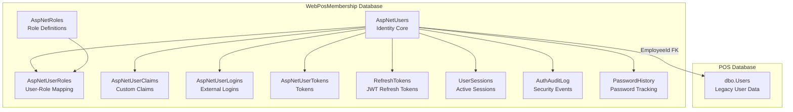
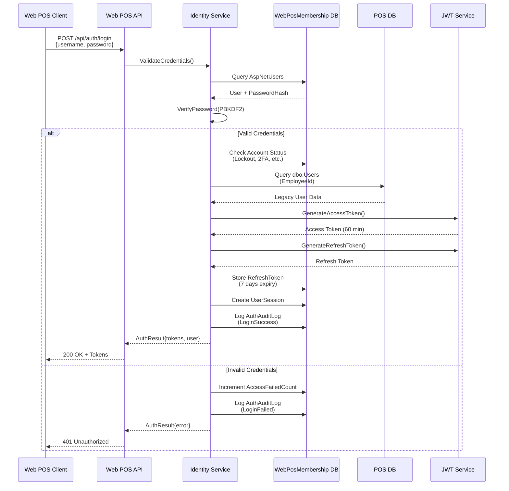
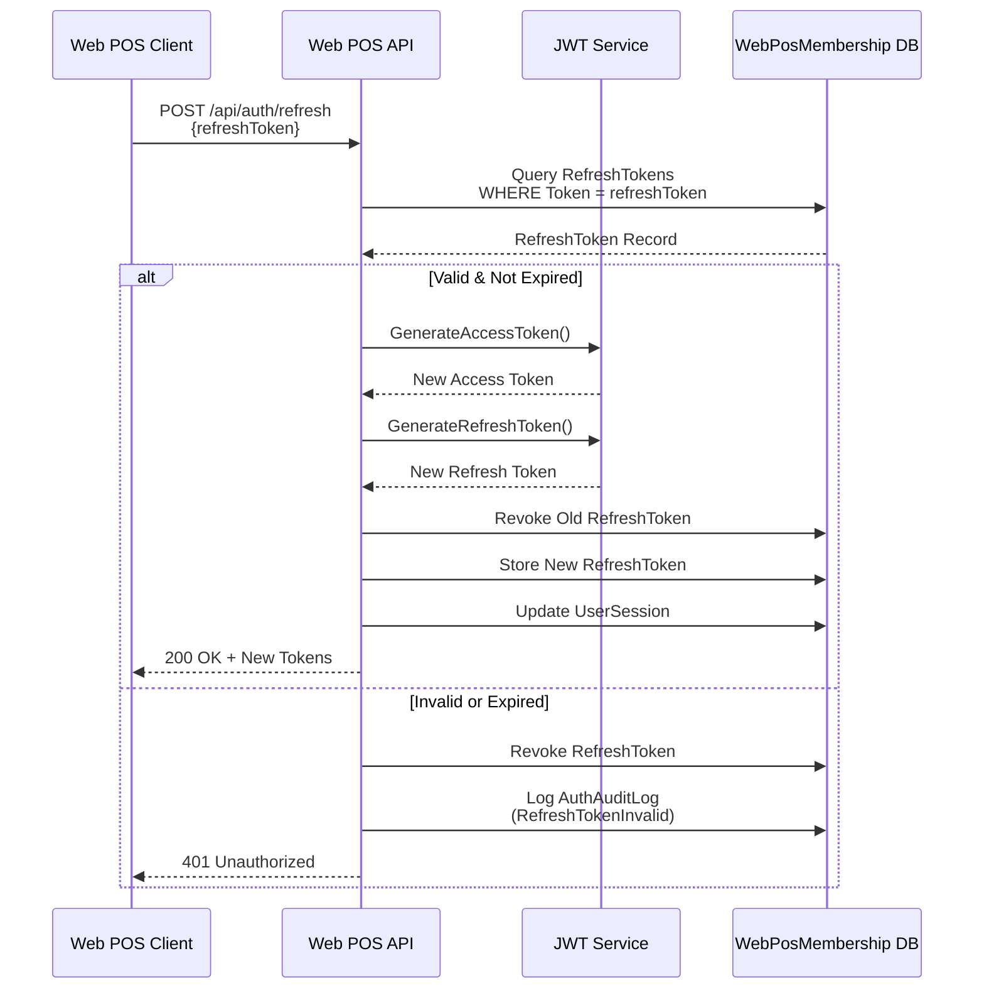

# Design Document: Web POS Membership Database

## Overview

The Web POS Membership Database is a separate, secure authentication and authorization system designed for the modern web-based MyChair POS application. This system provides ASP.NET Core Identity integration with proper password hashing, role-based access control, JWT refresh token management, and comprehensive audit logging while maintaining backward compatibility with the legacy WPF POS system through the existing dbo.Users table.

The design follows security best practices by isolating authentication data in a dedicated database (WebPosMembership), implementing modern password hashing (PBKDF2), supporting multi-factor authentication, and providing comprehensive session management and audit trails.

## Architecture

### Database Architecture



### Authentication Flow



### Token Refresh Flow



## Components and Interfaces

### Component 1: Identity Data Layer

**Purpose**: Manages ASP.NET Core Identity entities and custom authentication tables in WebPosMembership database

**Interface**:
```csharp
public interface IWebPosMembershipContext
{
    // ASP.NET Core Identity DbSets (inherited from IdentityDbContext)
    DbSet<ApplicationUser> Users { get; set; }
    DbSet<ApplicationRole> Roles { get; set; }
    DbSet<IdentityUserRole<string>> UserRoles { get; set; }
    DbSet<IdentityUserClaim<string>> UserClaims { get; set; }
    DbSet<IdentityUserLogin<string>> UserLogins { get; set; }
    DbSet<IdentityUserToken<string>> UserTokens { get; set; }
    
    // Custom authentication tables
    DbSet<RefreshToken> RefreshTokens { get; set; }
    DbSet<UserSession> UserSessions { get; set; }
    DbSet<AuthAuditLog> AuthAuditLogs { get; set; }
    DbSet<PasswordHistory> PasswordHistories { get; set; }
    
    Task<int> SaveChangesAsync(CancellationToken cancellationToken = default);
}
```

**Responsibilities**:
- Provide Entity Framework Core DbContext for WebPosMembership database
- Configure ASP.NET Core Identity entities with custom schema
- Manage custom authentication tables (RefreshTokens, UserSessions, etc.)
- Handle database migrations and schema updates


### Component 2: Authentication Service

**Purpose**: Handles user authentication, token generation, and session management

**Interface**:
```csharp
public interface IAuthenticationService
{
    Task<AuthenticationResult> LoginAsync(LoginRequest request);
    Task<AuthenticationResult> RefreshTokenAsync(string refreshToken);
    Task<bool> LogoutAsync(string userId, string sessionId);
    Task<bool> RevokeAllSessionsAsync(string userId);
    Task<bool> ValidateSessionAsync(string userId, string sessionId);
    Task<List<UserSessionDto>> GetActiveSessionsAsync(string userId);
}

public class AuthenticationResult
{
    public bool IsSuccessful { get; set; }
    public string? AccessToken { get; set; }
    public string? RefreshToken { get; set; }
    public int ExpiresIn { get; set; }
    public UserDto? User { get; set; }
    public string? ErrorMessage { get; set; }
    public AuthenticationError? ErrorCode { get; set; }
}
```

**Responsibilities**:
- Validate user credentials using ASP.NET Core Identity
- Generate JWT access and refresh tokens
- Manage user sessions and track active logins
- Handle account lockout and security policies
- Log authentication events to audit trail


### Component 3: User Migration Service

**Purpose**: Migrates existing users from legacy dbo.Users table to WebPosMembership database

**Interface**:
```csharp
public interface IUserMigrationService
{
    Task<MigrationResult> MigrateAllUsersAsync(bool forcePasswordReset = true);
    Task<MigrationResult> MigrateSingleUserAsync(int legacyUserId, string temporaryPassword);
    Task<MigrationReport> GetMigrationStatusAsync();
    Task<bool> SyncUserDataAsync(string identityUserId);
}

public class MigrationResult
{
    public int TotalUsers { get; set; }
    public int SuccessfulMigrations { get; set; }
    public int FailedMigrations { get; set; }
    public List<MigrationError> Errors { get; set; }
    public TimeSpan Duration { get; set; }
}
```

**Responsibilities**:
- Read users from legacy dbo.Users table
- Create corresponding AspNetUsers records with hashed passwords
- Map legacy PositionTypeID to ASP.NET Core Identity roles
- Generate temporary passwords for migrated users
- Link AspNetUsers to legacy Users via EmployeeId
- Log migration results and errors


### Component 4: Refresh Token Manager

**Purpose**: Manages JWT refresh token lifecycle, rotation, and revocation

**Interface**:
```csharp
public interface IRefreshTokenManager
{
    Task<RefreshToken> CreateRefreshTokenAsync(string userId, string deviceInfo);
    Task<RefreshToken?> ValidateRefreshTokenAsync(string token);
    Task<bool> RevokeRefreshTokenAsync(string token, string reason);
    Task<bool> RevokeAllUserTokensAsync(string userId);
    Task CleanupExpiredTokensAsync();
    Task<List<RefreshTokenDto>> GetUserTokensAsync(string userId);
}
```

**Responsibilities**:
- Generate cryptographically secure refresh tokens
- Store refresh tokens with expiration and device information
- Validate refresh tokens and check expiration
- Implement token rotation on refresh
- Revoke tokens on logout or security events
- Clean up expired tokens periodically


### Component 5: Audit Logging Service

**Purpose**: Records authentication and authorization events for security monitoring

**Interface**:
```csharp
public interface IAuditLoggingService
{
    Task LogLoginAttemptAsync(string username, bool success, string? ipAddress, string? userAgent);
    Task LogLogoutAsync(string userId, string sessionId);
    Task LogPasswordChangeAsync(string userId, bool success);
    Task LogAccountLockoutAsync(string userId, string reason);
    Task LogTokenRefreshAsync(string userId, bool success);
    Task LogSecurityEventAsync(SecurityEventType eventType, string userId, string details);
    Task<List<AuthAuditLogDto>> GetUserAuditLogsAsync(string userId, DateTime? from, DateTime? to);
}
```

**Responsibilities**:
- Log all authentication events (login, logout, token refresh)
- Record failed login attempts and account lockouts
- Track password changes and security events
- Store IP addresses and user agent information
- Provide audit trail for security investigations
- Support compliance and regulatory requirements


## Data Models

### Model 1: ApplicationUser (ASP.NET Core Identity)

```csharp
public class ApplicationUser : IdentityUser
{
    // Link to legacy POS database
    [Required]
    public int EmployeeId { get; set; }
    
    // Additional profile information
    [MaxLength(50)]
    public string? FirstName { get; set; }
    
    [MaxLength(50)]
    public string? LastName { get; set; }
    
    [MaxLength(100)]
    public string? DisplayName { get; set; }
    
    // Account status
    public bool IsActive { get; set; } = true;
    public DateTime CreatedAt { get; set; } = DateTime.UtcNow;
    public DateTime? LastLoginAt { get; set; }
    public DateTime? LastPasswordChangedAt { get; set; }
    
    // Security settings
    public bool RequirePasswordChange { get; set; } = false;
    public bool IsTwoFactorEnabled { get; set; } = false;
    
    // Navigation properties
    public virtual ICollection<RefreshToken> RefreshTokens { get; set; }
    public virtual ICollection<UserSession> UserSessions { get; set; }
    public virtual ICollection<AuthAuditLog> AuditLogs { get; set; }
    public virtual ICollection<PasswordHistory> PasswordHistories { get; set; }
}
```

**Validation Rules**:
- EmployeeId must reference valid dbo.Users.ID
- UserName must be unique and 3-50 characters
- Email must be valid format if provided
- PhoneNumber must match pattern if provided
- DisplayName defaults to FirstName + LastName


### Model 2: RefreshToken

```csharp
public class RefreshToken
{
    [Key]
    public int Id { get; set; }
    
    [Required]
    public string UserId { get; set; }
    
    [Required]
    [MaxLength(500)]
    public string Token { get; set; }
    
    [Required]
    public DateTime CreatedAt { get; set; } = DateTime.UtcNow;
    
    [Required]
    public DateTime ExpiresAt { get; set; }
    
    public DateTime? RevokedAt { get; set; }
    
    [MaxLength(200)]
    public string? RevokedReason { get; set; }
    
    [MaxLength(200)]
    public string? DeviceInfo { get; set; }
    
    [MaxLength(45)]
    public string? IpAddress { get; set; }
    
    public bool IsExpired => DateTime.UtcNow >= ExpiresAt;
    public bool IsRevoked => RevokedAt.HasValue;
    public bool IsActive => !IsExpired && !IsRevoked;
    
    // Navigation property
    public virtual ApplicationUser User { get; set; }
}
```

**Validation Rules**:
- Token must be unique and cryptographically secure (32 bytes)
- ExpiresAt must be after CreatedAt
- Default expiration: 7 days from creation
- RevokedReason required if RevokedAt is set


### Model 3: UserSession

```csharp
public class UserSession
{
    [Key]
    public Guid SessionId { get; set; } = Guid.NewGuid();
    
    [Required]
    public string UserId { get; set; }
    
    [Required]
    public DateTime CreatedAt { get; set; } = DateTime.UtcNow;
    
    public DateTime? LastActivityAt { get; set; }
    
    public DateTime? EndedAt { get; set; }
    
    [Required]
    [MaxLength(20)]
    public string DeviceType { get; set; } // Desktop, Tablet, Mobile
    
    [MaxLength(200)]
    public string? DeviceInfo { get; set; }
    
    [MaxLength(45)]
    public string? IpAddress { get; set; }
    
    [MaxLength(500)]
    public string? UserAgent { get; set; }
    
    public bool IsActive => !EndedAt.HasValue;
    
    // Navigation property
    public virtual ApplicationUser User { get; set; }
}
```

**Validation Rules**:
- SessionId must be unique GUID
- DeviceType must be one of: Desktop, Tablet, Mobile
- LastActivityAt updated on each API request
- EndedAt set on logout or session expiration


### Model 4: AuthAuditLog

```csharp
public class AuthAuditLog
{
    [Key]
    public long Id { get; set; }
    
    public string? UserId { get; set; }
    
    [MaxLength(100)]
    public string? UserName { get; set; }
    
    [Required]
    [MaxLength(50)]
    public string EventType { get; set; } // LoginSuccess, LoginFailed, Logout, etc.
    
    [Required]
    public DateTime Timestamp { get; set; } = DateTime.UtcNow;
    
    [MaxLength(45)]
    public string? IpAddress { get; set; }
    
    [MaxLength(500)]
    public string? UserAgent { get; set; }
    
    [MaxLength(1000)]
    public string? Details { get; set; }
    
    public bool IsSuccessful { get; set; }
    
    [MaxLength(500)]
    public string? ErrorMessage { get; set; }
    
    // Navigation property
    public virtual ApplicationUser? User { get; set; }
}
```

**Validation Rules**:
- EventType must be from predefined list (LoginSuccess, LoginFailed, Logout, PasswordChanged, AccountLocked, TokenRefreshed, etc.)
- Timestamp defaults to UTC now
- UserId nullable for failed login attempts (user not found)
- Details stored as JSON for structured data


### Model 5: PasswordHistory

```csharp
public class PasswordHistory
{
    [Key]
    public int Id { get; set; }
    
    [Required]
    public string UserId { get; set; }
    
    [Required]
    [MaxLength(500)]
    public string PasswordHash { get; set; }
    
    [Required]
    public DateTime CreatedAt { get; set; } = DateTime.UtcNow;
    
    [MaxLength(100)]
    public string? ChangedBy { get; set; } // UserId or "System" or "Admin"
    
    [MaxLength(200)]
    public string? ChangeReason { get; set; }
    
    // Navigation property
    public virtual ApplicationUser User { get; set; }
}
```

**Validation Rules**:
- Store last 5 password hashes per user
- Prevent password reuse within history
- PasswordHash uses same algorithm as Identity (PBKDF2)
- ChangedBy tracks who initiated the password change


### Model 6: ApplicationRole (ASP.NET Core Identity)

```csharp
public class ApplicationRole : IdentityRole
{
    [MaxLength(500)]
    public string? Description { get; set; }
    
    public DateTime CreatedAt { get; set; } = DateTime.UtcNow;
    
    public bool IsSystemRole { get; set; } = false;
    
    // Predefined roles
    public static class Roles
    {
        public const string Admin = "Admin";
        public const string Manager = "Manager";
        public const string Cashier = "Cashier";
        public const string Waiter = "Waiter";
        public const string Kitchen = "Kitchen";
    }
}
```

**Validation Rules**:
- Role names must be unique
- System roles (Admin, Manager, Cashier, Waiter, Kitchen) cannot be deleted
- Description optional but recommended
- Role names are case-insensitive


## Algorithmic Pseudocode

### Main Authentication Algorithm

```csharp
ALGORITHM AuthenticateUser
INPUT: username (string), password (string), deviceInfo (string), ipAddress (string)
OUTPUT: AuthenticationResult

BEGIN
  ASSERT username IS NOT NULL AND username IS NOT EMPTY
  ASSERT password IS NOT NULL AND password IS NOT EMPTY
  
  // Step 1: Find user by username
  user ← FindUserByUsername(username)
  
  IF user IS NULL THEN
    LogAuditEvent("LoginFailed", username, "UserNotFound", ipAddress)
    RETURN AuthenticationResult.Failed("Invalid credentials")
  END IF
  
  // Step 2: Check account status
  IF user.IsActive = FALSE THEN
    LogAuditEvent("LoginFailed", username, "AccountDisabled", ipAddress)
    RETURN AuthenticationResult.Failed("Account is disabled")
  END IF
  
  IF user.LockoutEnabled AND user.LockoutEnd > DateTime.UtcNow THEN
    LogAuditEvent("LoginFailed", username, "AccountLocked", ipAddress)
    RETURN AuthenticationResult.Failed("Account is locked")
  END IF
  
  // Step 3: Verify password using PBKDF2
  passwordValid ← VerifyPasswordHash(password, user.PasswordHash)
  
  IF passwordValid = FALSE THEN
    IncrementAccessFailedCount(user)
    
    IF user.AccessFailedCount >= MaxFailedAttempts THEN
      LockAccount(user, LockoutDuration)
      LogAuditEvent("AccountLocked", user.Id, "MaxAttemptsExceeded", ipAddress)
    END IF
    
    LogAuditEvent("LoginFailed", username, "InvalidPassword", ipAddress)
    RETURN AuthenticationResult.Failed("Invalid credentials")
  END IF
  
  // Step 4: Reset failed attempts on successful login
  ResetAccessFailedCount(user)
  
  // Step 5: Check if 2FA is required
  IF user.TwoFactorEnabled = TRUE THEN
    twoFactorToken ← GenerateTwoFactorToken(user)
    SendTwoFactorCode(user, twoFactorToken)
    RETURN AuthenticationResult.RequiresTwoFactor(user.Id)
  END IF
  
  // Step 6: Generate tokens
  accessToken ← GenerateAccessToken(user)
  refreshToken ← GenerateRefreshToken()
  
  // Step 7: Store refresh token
  StoreRefreshToken(user.Id, refreshToken, deviceInfo, ipAddress, ExpiresIn7Days)
  
  // Step 8: Create user session
  sessionId ← CreateUserSession(user.Id, deviceInfo, ipAddress)
  
  // Step 9: Update last login timestamp
  UpdateLastLoginTimestamp(user)
  
  // Step 10: Log successful login
  LogAuditEvent("LoginSuccess", user.Id, "PasswordAuthentication", ipAddress)
  
  RETURN AuthenticationResult.Success(accessToken, refreshToken, user)
END
```

**Preconditions:**
- username and password are non-null and non-empty strings
- Database connection is available
- Identity configuration is properly initialized
- JWT secret key is configured

**Postconditions:**
- If successful: User is authenticated, tokens are generated and stored, session is created, audit log is recorded
- If failed: Failed attempt is logged, access failed count is incremented, account may be locked
- No side effects on input parameters
- All database operations are within a transaction

**Loop Invariants:** N/A (no loops in main algorithm)


### Token Refresh Algorithm

```csharp
ALGORITHM RefreshAccessToken
INPUT: refreshToken (string), deviceInfo (string), ipAddress (string)
OUTPUT: AuthenticationResult

BEGIN
  ASSERT refreshToken IS NOT NULL AND refreshToken IS NOT EMPTY
  
  // Step 1: Find refresh token in database
  storedToken ← FindRefreshToken(refreshToken)
  
  IF storedToken IS NULL THEN
    LogAuditEvent("TokenRefreshFailed", NULL, "TokenNotFound", ipAddress)
    RETURN AuthenticationResult.Failed("Invalid refresh token")
  END IF
  
  // Step 2: Validate token status
  IF storedToken.IsRevoked = TRUE THEN
    LogAuditEvent("TokenRefreshFailed", storedToken.UserId, "TokenRevoked", ipAddress)
    RETURN AuthenticationResult.Failed("Token has been revoked")
  END IF
  
  IF storedToken.IsExpired = TRUE THEN
    RevokeRefreshToken(storedToken, "Expired")
    LogAuditEvent("TokenRefreshFailed", storedToken.UserId, "TokenExpired", ipAddress)
    RETURN AuthenticationResult.Failed("Token has expired")
  END IF
  
  // Step 3: Get user and validate account status
  user ← FindUserById(storedToken.UserId)
  
  IF user IS NULL OR user.IsActive = FALSE THEN
    RevokeRefreshToken(storedToken, "UserInactive")
    LogAuditEvent("TokenRefreshFailed", storedToken.UserId, "UserInactive", ipAddress)
    RETURN AuthenticationResult.Failed("User account is not active")
  END IF
  
  // Step 4: Generate new tokens (token rotation)
  newAccessToken ← GenerateAccessToken(user)
  newRefreshToken ← GenerateRefreshToken()
  
  // Step 5: Revoke old refresh token
  RevokeRefreshToken(storedToken, "Rotated")
  
  // Step 6: Store new refresh token
  StoreRefreshToken(user.Id, newRefreshToken, deviceInfo, ipAddress, ExpiresIn7Days)
  
  // Step 7: Update user session
  UpdateUserSession(user.Id, deviceInfo, ipAddress)
  
  // Step 8: Log successful token refresh
  LogAuditEvent("TokenRefreshSuccess", user.Id, "TokenRotation", ipAddress)
  
  RETURN AuthenticationResult.Success(newAccessToken, newRefreshToken, user)
END
```

**Preconditions:**
- refreshToken is a non-null, non-empty string
- Database connection is available
- JWT configuration is properly initialized

**Postconditions:**
- If successful: New access and refresh tokens are generated, old refresh token is revoked, session is updated
- If failed: Appropriate error is returned, invalid tokens may be revoked, audit log is recorded
- Token rotation ensures old refresh tokens cannot be reused
- All database operations are atomic

**Loop Invariants:** N/A (no loops in main algorithm)


### User Migration Algorithm

```csharp
ALGORITHM MigrateLegacyUsers
INPUT: forcePasswordReset (boolean)
OUTPUT: MigrationResult

BEGIN
  migrationResult ← NEW MigrationResult()
  startTime ← DateTime.UtcNow
  
  // Step 1: Fetch all active users from legacy database
  legacyUsers ← QueryLegacyUsers("SELECT * FROM dbo.Users WHERE IsActive = 1")
  migrationResult.TotalUsers ← legacyUsers.Count
  
  // Step 2: Iterate through legacy users
  FOR EACH legacyUser IN legacyUsers DO
    ASSERT legacyUser.ID IS NOT NULL
    
    TRY
      // Check if user already migrated
      existingUser ← FindUserByEmployeeId(legacyUser.ID)
      
      IF existingUser IS NOT NULL THEN
        CONTINUE // Skip already migrated users
      END IF
      
      // Generate temporary password
      temporaryPassword ← GenerateSecurePassword(12)
      
      // Create ApplicationUser
      newUser ← NEW ApplicationUser {
        EmployeeId = legacyUser.ID,
        UserName = legacyUser.Name,
        Email = GenerateEmail(legacyUser.Name),
        FirstName = legacyUser.Name,
        LastName = legacyUser.Surname,
        DisplayName = legacyUser.Name + " " + legacyUser.Surname,
        IsActive = legacyUser.IsActive,
        RequirePasswordChange = forcePasswordReset,
        CreatedAt = DateTime.UtcNow
      }
      
      // Create user with hashed password (PBKDF2)
      result ← CreateUserWithPassword(newUser, temporaryPassword)
      
      IF result.Succeeded = FALSE THEN
        migrationResult.FailedMigrations++
        migrationResult.Errors.Add(NEW MigrationError {
          LegacyUserId = legacyUser.ID,
          UserName = legacyUser.Name,
          ErrorMessage = result.Errors.ToString()
        })
        CONTINUE
      END IF
      
      // Map legacy PositionTypeID to role
      roleName ← MapPositionTypeToRole(legacyUser.PositionTypeID)
      AddUserToRole(newUser, roleName)
      
      // Store temporary password for admin notification
      LogTemporaryPassword(legacyUser.ID, newUser.Id, temporaryPassword)
      
      migrationResult.SuccessfulMigrations++
      
    CATCH Exception ex
      migrationResult.FailedMigrations++
      migrationResult.Errors.Add(NEW MigrationError {
        LegacyUserId = legacyUser.ID,
        UserName = legacyUser.Name,
        ErrorMessage = ex.Message
      })
    END TRY
  END FOR
  
  endTime ← DateTime.UtcNow
  migrationResult.Duration ← endTime - startTime
  
  // Log migration summary
  LogMigrationSummary(migrationResult)
  
  RETURN migrationResult
END

FUNCTION MapPositionTypeToRole(positionTypeId)
INPUT: positionTypeId (byte)
OUTPUT: roleName (string)

BEGIN
  RETURN positionTypeId MATCH
    CASE 1: "Cashier"
    CASE 2: "Admin"
    CASE 3: "Manager"
    CASE 4: "Waiter"
    CASE 5: "Kitchen"
    DEFAULT: "Cashier"
  END MATCH
END
```

**Preconditions:**
- Both POS database and WebPosMembership database are accessible
- Legacy dbo.Users table exists and contains valid data
- ASP.NET Core Identity is properly configured
- Roles (Admin, Manager, Cashier, Waiter, Kitchen) exist in AspNetRoles table

**Postconditions:**
- All active legacy users are migrated to WebPosMembership database
- Each migrated user has a secure temporary password
- Users are assigned appropriate roles based on PositionTypeID
- Migration results are logged with success/failure counts
- Failed migrations are recorded with error details
- No changes to legacy dbo.Users table

**Loop Invariants:**
- All previously processed users remain migrated
- Migration counters (successful, failed) accurately reflect processed users
- Database consistency maintained throughout iteration


## Key Functions with Formal Specifications

### Function 1: VerifyPasswordHash()

```csharp
public async Task<bool> VerifyPasswordHash(ApplicationUser user, string password)
```

**Preconditions:**
- `user` is non-null and has valid PasswordHash
- `password` is non-null and non-empty string
- PasswordHasher is properly initialized

**Postconditions:**
- Returns `true` if password matches stored hash
- Returns `false` if password does not match
- No side effects on user object or database
- Uses constant-time comparison to prevent timing attacks

**Loop Invariants:** N/A

### Function 2: GenerateRefreshToken()

```csharp
public string GenerateRefreshToken()
```

**Preconditions:**
- Cryptographic random number generator is available
- System has sufficient entropy for secure random generation

**Postconditions:**
- Returns cryptographically secure random token (Base64 encoded, 32 bytes)
- Token is unique with high probability (collision probability < 2^-128)
- Token contains no predictable patterns
- No side effects

**Loop Invariants:** N/A

### Function 3: StoreRefreshToken()

```csharp
public async Task<RefreshToken> StoreRefreshToken(
    string userId, 
    string token, 
    string deviceInfo, 
    string ipAddress, 
    TimeSpan expiresIn)
```

**Preconditions:**
- `userId` references valid ApplicationUser
- `token` is non-null, non-empty, and unique
- `expiresIn` is positive TimeSpan
- Database connection is available

**Postconditions:**
- RefreshToken record is created in database
- Token is associated with user
- ExpiresAt is set to DateTime.UtcNow + expiresIn
- DeviceInfo and IpAddress are stored
- Returns created RefreshToken entity
- Transaction is committed

**Loop Invariants:** N/A


### Function 4: CreateUserSession()

```csharp
public async Task<Guid> CreateUserSession(
    string userId, 
    string deviceType, 
    string deviceInfo, 
    string ipAddress, 
    string userAgent)
```

**Preconditions:**
- `userId` references valid ApplicationUser
- `deviceType` is one of: "Desktop", "Tablet", "Mobile"
- Database connection is available

**Postconditions:**
- UserSession record is created with unique SessionId (GUID)
- Session is associated with user
- CreatedAt and LastActivityAt are set to DateTime.UtcNow
- DeviceInfo, IpAddress, and UserAgent are stored
- Returns SessionId (GUID)
- Transaction is committed

**Loop Invariants:** N/A

### Function 5: RevokeRefreshToken()

```csharp
public async Task<bool> RevokeRefreshToken(string token, string reason)
```

**Preconditions:**
- `token` is non-null and non-empty
- `reason` is non-null and describes revocation cause
- Database connection is available

**Postconditions:**
- If token exists: RevokedAt is set to DateTime.UtcNow, RevokedReason is set, returns `true`
- If token not found: No changes, returns `false`
- Token cannot be used for authentication after revocation
- Transaction is committed

**Loop Invariants:** N/A

### Function 6: CleanupExpiredTokens()

```csharp
public async Task<int> CleanupExpiredTokens()
```

**Preconditions:**
- Database connection is available
- Sufficient permissions to delete records

**Postconditions:**
- All RefreshTokens where ExpiresAt < DateTime.UtcNow are deleted
- Returns count of deleted tokens
- Database integrity maintained
- Transaction is committed

**Loop Invariants:**
- All tokens processed so far are either deleted (if expired) or retained (if not expired)
- Database consistency maintained throughout deletion process


## Example Usage

### Example 1: User Login Flow

```csharp
// Controller endpoint
[HttpPost("login")]
public async Task<IActionResult> Login([FromBody] LoginRequest request)
{
    var ipAddress = HttpContext.Connection.RemoteIpAddress?.ToString();
    var userAgent = HttpContext.Request.Headers["User-Agent"].ToString();
    var deviceInfo = $"{request.DeviceType} - {userAgent}";
    
    var result = await _authenticationService.LoginAsync(
        request.Username,
        request.Password,
        deviceInfo,
        ipAddress
    );
    
    if (!result.IsSuccessful)
    {
        return Unauthorized(new { error = result.ErrorMessage });
    }
    
    return Ok(new
    {
        accessToken = result.AccessToken,
        refreshToken = result.RefreshToken,
        expiresIn = result.ExpiresIn,
        user = result.User
    });
}

// Service implementation
public async Task<AuthenticationResult> LoginAsync(
    string username, 
    string password, 
    string deviceInfo, 
    string ipAddress)
{
    // Find user
    var user = await _userManager.FindByNameAsync(username);
    if (user == null)
    {
        await _auditService.LogLoginAttemptAsync(username, false, ipAddress, deviceInfo);
        return AuthenticationResult.Failed("Invalid credentials");
    }
    
    // Verify password
    var passwordValid = await _userManager.CheckPasswordAsync(user, password);
    if (!passwordValid)
    {
        await _userManager.AccessFailedAsync(user);
        await _auditService.LogLoginAttemptAsync(username, false, ipAddress, deviceInfo);
        return AuthenticationResult.Failed("Invalid credentials");
    }
    
    // Generate tokens
    var accessToken = _jwtService.GenerateAccessToken(user);
    var refreshToken = _jwtService.GenerateRefreshToken();
    
    // Store refresh token
    await _refreshTokenManager.CreateRefreshTokenAsync(user.Id, refreshToken, deviceInfo, ipAddress);
    
    // Create session
    var sessionId = await _sessionManager.CreateSessionAsync(user.Id, deviceInfo, ipAddress);
    
    // Update last login
    user.LastLoginAt = DateTime.UtcNow;
    await _userManager.UpdateAsync(user);
    
    // Log success
    await _auditService.LogLoginAttemptAsync(username, true, ipAddress, deviceInfo);
    
    return AuthenticationResult.Success(accessToken, refreshToken, user);
}
```


### Example 2: Token Refresh Flow

```csharp
// Controller endpoint
[HttpPost("refresh")]
public async Task<IActionResult> RefreshToken([FromBody] RefreshTokenRequest request)
{
    var ipAddress = HttpContext.Connection.RemoteIpAddress?.ToString();
    var userAgent = HttpContext.Request.Headers["User-Agent"].ToString();
    
    var result = await _authenticationService.RefreshTokenAsync(
        request.RefreshToken,
        userAgent,
        ipAddress
    );
    
    if (!result.IsSuccessful)
    {
        return Unauthorized(new { error = result.ErrorMessage });
    }
    
    return Ok(new
    {
        accessToken = result.AccessToken,
        refreshToken = result.RefreshToken,
        expiresIn = result.ExpiresIn
    });
}

// Service implementation
public async Task<AuthenticationResult> RefreshTokenAsync(
    string refreshToken, 
    string deviceInfo, 
    string ipAddress)
{
    // Validate refresh token
    var storedToken = await _refreshTokenManager.ValidateRefreshTokenAsync(refreshToken);
    if (storedToken == null || !storedToken.IsActive)
    {
        await _auditService.LogTokenRefreshAsync(null, false);
        return AuthenticationResult.Failed("Invalid or expired refresh token");
    }
    
    // Get user
    var user = await _userManager.FindByIdAsync(storedToken.UserId);
    if (user == null || !user.IsActive)
    {
        await _refreshTokenManager.RevokeRefreshTokenAsync(refreshToken, "User inactive");
        return AuthenticationResult.Failed("User account is not active");
    }
    
    // Generate new tokens (token rotation)
    var newAccessToken = _jwtService.GenerateAccessToken(user);
    var newRefreshToken = _jwtService.GenerateRefreshToken();
    
    // Revoke old token
    await _refreshTokenManager.RevokeRefreshTokenAsync(refreshToken, "Rotated");
    
    // Store new token
    await _refreshTokenManager.CreateRefreshTokenAsync(user.Id, newRefreshToken, deviceInfo, ipAddress);
    
    // Update session
    await _sessionManager.UpdateSessionActivityAsync(user.Id, ipAddress);
    
    // Log success
    await _auditService.LogTokenRefreshAsync(user.Id, true);
    
    return AuthenticationResult.Success(newAccessToken, newRefreshToken, user);
}
```


### Example 3: User Migration

```csharp
// Migration utility
public async Task<MigrationResult> MigrateAllUsersAsync(bool forcePasswordReset = true)
{
    var result = new MigrationResult();
    var startTime = DateTime.UtcNow;
    
    // Get legacy users from POS database
    var legacyUsers = await _posDbContext.Users
        .Where(u => u.IsActive)
        .ToListAsync();
    
    result.TotalUsers = legacyUsers.Count;
    
    foreach (var legacyUser in legacyUsers)
    {
        try
        {
            // Check if already migrated
            var existing = await _userManager.Users
                .FirstOrDefaultAsync(u => u.EmployeeId == legacyUser.ID);
            
            if (existing != null)
            {
                continue; // Skip already migrated
            }
            
            // Generate temporary password
            var tempPassword = GenerateSecurePassword(12);
            
            // Create new user
            var newUser = new ApplicationUser
            {
                EmployeeId = legacyUser.ID,
                UserName = legacyUser.Name,
                Email = $"{legacyUser.Name.ToLower()}@mychair.local",
                FirstName = legacyUser.Name,
                LastName = legacyUser.Surname,
                DisplayName = legacyUser.FullName,
                IsActive = legacyUser.IsActive,
                RequirePasswordChange = forcePasswordReset,
                CreatedAt = DateTime.UtcNow
            };
            
            // Create user with hashed password
            var createResult = await _userManager.CreateAsync(newUser, tempPassword);
            
            if (!createResult.Succeeded)
            {
                result.FailedMigrations++;
                result.Errors.Add(new MigrationError
                {
                    LegacyUserId = legacyUser.ID,
                    UserName = legacyUser.Name,
                    ErrorMessage = string.Join(", ", createResult.Errors.Select(e => e.Description))
                });
                continue;
            }
            
            // Assign role based on PositionTypeID
            var roleName = MapPositionTypeToRole(legacyUser.PositionTypeID);
            await _userManager.AddToRoleAsync(newUser, roleName);
            
            // Log temporary password (for admin notification)
            _logger.LogInformation(
                "User migrated: {UserName} (EmployeeId: {EmployeeId}) - Temp Password: {Password}",
                newUser.UserName, newUser.EmployeeId, tempPassword);
            
            result.SuccessfulMigrations++;
        }
        catch (Exception ex)
        {
            result.FailedMigrations++;
            result.Errors.Add(new MigrationError
            {
                LegacyUserId = legacyUser.ID,
                UserName = legacyUser.Name,
                ErrorMessage = ex.Message
            });
        }
    }
    
    result.Duration = DateTime.UtcNow - startTime;
    return result;
}

private string MapPositionTypeToRole(byte positionTypeId)
{
    return positionTypeId switch
    {
        1 => ApplicationRole.Roles.Cashier,
        2 => ApplicationRole.Roles.Admin,
        3 => ApplicationRole.Roles.Manager,
        4 => ApplicationRole.Roles.Waiter,
        5 => ApplicationRole.Roles.Kitchen,
        _ => ApplicationRole.Roles.Cashier
    };
}
```


## Database Schema

### ASP.NET Core Identity Tables (Standard)

#### AspNetUsers
```sql
CREATE TABLE [dbo].[AspNetUsers] (
    [Id] NVARCHAR(450) NOT NULL PRIMARY KEY,
    [UserName] NVARCHAR(256) NOT NULL,
    [NormalizedUserName] NVARCHAR(256) NOT NULL,
    [Email] NVARCHAR(256) NULL,
    [NormalizedEmail] NVARCHAR(256) NULL,
    [EmailConfirmed] BIT NOT NULL DEFAULT 0,
    [PasswordHash] NVARCHAR(MAX) NULL,
    [SecurityStamp] NVARCHAR(MAX) NULL,
    [ConcurrencyStamp] NVARCHAR(MAX) NULL,
    [PhoneNumber] NVARCHAR(MAX) NULL,
    [PhoneNumberConfirmed] BIT NOT NULL DEFAULT 0,
    [TwoFactorEnabled] BIT NOT NULL DEFAULT 0,
    [LockoutEnd] DATETIMEOFFSET(7) NULL,
    [LockoutEnabled] BIT NOT NULL DEFAULT 1,
    [AccessFailedCount] INT NOT NULL DEFAULT 0,
    
    -- Custom fields
    [EmployeeId] INT NOT NULL,
    [FirstName] NVARCHAR(50) NULL,
    [LastName] NVARCHAR(50) NULL,
    [DisplayName] NVARCHAR(100) NULL,
    [IsActive] BIT NOT NULL DEFAULT 1,
    [CreatedAt] DATETIME2 NOT NULL DEFAULT GETUTCDATE(),
    [LastLoginAt] DATETIME2 NULL,
    [LastPasswordChangedAt] DATETIME2 NULL,
    [RequirePasswordChange] BIT NOT NULL DEFAULT 0,
    [IsTwoFactorEnabled] BIT NOT NULL DEFAULT 0,
    
    CONSTRAINT [UQ_AspNetUsers_EmployeeId] UNIQUE ([EmployeeId]),
    CONSTRAINT [IX_AspNetUsers_NormalizedUserName] UNIQUE ([NormalizedUserName]),
    CONSTRAINT [IX_AspNetUsers_NormalizedEmail] UNIQUE ([NormalizedEmail])
);

CREATE INDEX [IX_AspNetUsers_EmployeeId] ON [dbo].[AspNetUsers]([EmployeeId]);
CREATE INDEX [IX_AspNetUsers_IsActive] ON [dbo].[AspNetUsers]([IsActive]);
```

#### AspNetRoles
```sql
CREATE TABLE [dbo].[AspNetRoles] (
    [Id] NVARCHAR(450) NOT NULL PRIMARY KEY,
    [Name] NVARCHAR(256) NOT NULL,
    [NormalizedName] NVARCHAR(256) NOT NULL,
    [ConcurrencyStamp] NVARCHAR(MAX) NULL,
    
    -- Custom fields
    [Description] NVARCHAR(500) NULL,
    [CreatedAt] DATETIME2 NOT NULL DEFAULT GETUTCDATE(),
    [IsSystemRole] BIT NOT NULL DEFAULT 0,
    
    CONSTRAINT [IX_AspNetRoles_NormalizedName] UNIQUE ([NormalizedName])
);
```

#### AspNetUserRoles
```sql
CREATE TABLE [dbo].[AspNetUserRoles] (
    [UserId] NVARCHAR(450) NOT NULL,
    [RoleId] NVARCHAR(450) NOT NULL,
    
    CONSTRAINT [PK_AspNetUserRoles] PRIMARY KEY ([UserId], [RoleId]),
    CONSTRAINT [FK_AspNetUserRoles_AspNetUsers] FOREIGN KEY ([UserId]) 
        REFERENCES [dbo].[AspNetUsers]([Id]) ON DELETE CASCADE,
    CONSTRAINT [FK_AspNetUserRoles_AspNetRoles] FOREIGN KEY ([RoleId]) 
        REFERENCES [dbo].[AspNetRoles]([Id]) ON DELETE CASCADE
);

CREATE INDEX [IX_AspNetUserRoles_RoleId] ON [dbo].[AspNetUserRoles]([RoleId]);
```


#### AspNetUserClaims
```sql
CREATE TABLE [dbo].[AspNetUserClaims] (
    [Id] INT IDENTITY(1,1) NOT NULL PRIMARY KEY,
    [UserId] NVARCHAR(450) NOT NULL,
    [ClaimType] NVARCHAR(MAX) NULL,
    [ClaimValue] NVARCHAR(MAX) NULL,
    
    CONSTRAINT [FK_AspNetUserClaims_AspNetUsers] FOREIGN KEY ([UserId]) 
        REFERENCES [dbo].[AspNetUsers]([Id]) ON DELETE CASCADE
);

CREATE INDEX [IX_AspNetUserClaims_UserId] ON [dbo].[AspNetUserClaims]([UserId]);
```

#### AspNetUserLogins
```sql
CREATE TABLE [dbo].[AspNetUserLogins] (
    [LoginProvider] NVARCHAR(450) NOT NULL,
    [ProviderKey] NVARCHAR(450) NOT NULL,
    [ProviderDisplayName] NVARCHAR(MAX) NULL,
    [UserId] NVARCHAR(450) NOT NULL,
    
    CONSTRAINT [PK_AspNetUserLogins] PRIMARY KEY ([LoginProvider], [ProviderKey]),
    CONSTRAINT [FK_AspNetUserLogins_AspNetUsers] FOREIGN KEY ([UserId]) 
        REFERENCES [dbo].[AspNetUsers]([Id]) ON DELETE CASCADE
);

CREATE INDEX [IX_AspNetUserLogins_UserId] ON [dbo].[AspNetUserLogins]([UserId]);
```

#### AspNetUserTokens
```sql
CREATE TABLE [dbo].[AspNetUserTokens] (
    [UserId] NVARCHAR(450) NOT NULL,
    [LoginProvider] NVARCHAR(450) NOT NULL,
    [Name] NVARCHAR(450) NOT NULL,
    [Value] NVARCHAR(MAX) NULL,
    
    CONSTRAINT [PK_AspNetUserTokens] PRIMARY KEY ([UserId], [LoginProvider], [Name]),
    CONSTRAINT [FK_AspNetUserTokens_AspNetUsers] FOREIGN KEY ([UserId]) 
        REFERENCES [dbo].[AspNetUsers]([Id]) ON DELETE CASCADE
);
```

#### AspNetRoleClaims
```sql
CREATE TABLE [dbo].[AspNetRoleClaims] (
    [Id] INT IDENTITY(1,1) NOT NULL PRIMARY KEY,
    [RoleId] NVARCHAR(450) NOT NULL,
    [ClaimType] NVARCHAR(MAX) NULL,
    [ClaimValue] NVARCHAR(MAX) NULL,
    
    CONSTRAINT [FK_AspNetRoleClaims_AspNetRoles] FOREIGN KEY ([RoleId]) 
        REFERENCES [dbo].[AspNetRoles]([Id]) ON DELETE CASCADE
);

CREATE INDEX [IX_AspNetRoleClaims_RoleId] ON [dbo].[AspNetRoleClaims]([RoleId]);
```


### Custom Authentication Tables

#### RefreshTokens
```sql
CREATE TABLE [dbo].[RefreshTokens] (
    [Id] INT IDENTITY(1,1) NOT NULL PRIMARY KEY,
    [UserId] NVARCHAR(450) NOT NULL,
    [Token] NVARCHAR(500) NOT NULL,
    [CreatedAt] DATETIME2 NOT NULL DEFAULT GETUTCDATE(),
    [ExpiresAt] DATETIME2 NOT NULL,
    [RevokedAt] DATETIME2 NULL,
    [RevokedReason] NVARCHAR(200) NULL,
    [DeviceInfo] NVARCHAR(200) NULL,
    [IpAddress] NVARCHAR(45) NULL,
    
    CONSTRAINT [FK_RefreshTokens_AspNetUsers] FOREIGN KEY ([UserId]) 
        REFERENCES [dbo].[AspNetUsers]([Id]) ON DELETE CASCADE,
    CONSTRAINT [UQ_RefreshTokens_Token] UNIQUE ([Token])
);

CREATE INDEX [IX_RefreshTokens_UserId] ON [dbo].[RefreshTokens]([UserId]);
CREATE INDEX [IX_RefreshTokens_Token] ON [dbo].[RefreshTokens]([Token]);
CREATE INDEX [IX_RefreshTokens_ExpiresAt] ON [dbo].[RefreshTokens]([ExpiresAt]);
CREATE INDEX [IX_RefreshTokens_RevokedAt] ON [dbo].[RefreshTokens]([RevokedAt]);
```

#### UserSessions
```sql
CREATE TABLE [dbo].[UserSessions] (
    [SessionId] UNIQUEIDENTIFIER NOT NULL PRIMARY KEY DEFAULT NEWID(),
    [UserId] NVARCHAR(450) NOT NULL,
    [CreatedAt] DATETIME2 NOT NULL DEFAULT GETUTCDATE(),
    [LastActivityAt] DATETIME2 NULL,
    [EndedAt] DATETIME2 NULL,
    [DeviceType] NVARCHAR(20) NOT NULL,
    [DeviceInfo] NVARCHAR(200) NULL,
    [IpAddress] NVARCHAR(45) NULL,
    [UserAgent] NVARCHAR(500) NULL,
    
    CONSTRAINT [FK_UserSessions_AspNetUsers] FOREIGN KEY ([UserId]) 
        REFERENCES [dbo].[AspNetUsers]([Id]) ON DELETE CASCADE,
    CONSTRAINT [CHK_UserSessions_DeviceType] CHECK ([DeviceType] IN ('Desktop', 'Tablet', 'Mobile'))
);

CREATE INDEX [IX_UserSessions_UserId] ON [dbo].[UserSessions]([UserId]);
CREATE INDEX [IX_UserSessions_CreatedAt] ON [dbo].[UserSessions]([CreatedAt]);
CREATE INDEX [IX_UserSessions_EndedAt] ON [dbo].[UserSessions]([EndedAt]);
```

#### AuthAuditLog
```sql
CREATE TABLE [dbo].[AuthAuditLog] (
    [Id] BIGINT IDENTITY(1,1) NOT NULL PRIMARY KEY,
    [UserId] NVARCHAR(450) NULL,
    [UserName] NVARCHAR(100) NULL,
    [EventType] NVARCHAR(50) NOT NULL,
    [Timestamp] DATETIME2 NOT NULL DEFAULT GETUTCDATE(),
    [IpAddress] NVARCHAR(45) NULL,
    [UserAgent] NVARCHAR(500) NULL,
    [Details] NVARCHAR(1000) NULL,
    [IsSuccessful] BIT NOT NULL,
    [ErrorMessage] NVARCHAR(500) NULL,
    
    CONSTRAINT [FK_AuthAuditLog_AspNetUsers] FOREIGN KEY ([UserId]) 
        REFERENCES [dbo].[AspNetUsers]([Id]) ON DELETE SET NULL
);

CREATE INDEX [IX_AuthAuditLog_UserId] ON [dbo].[AuthAuditLog]([UserId]);
CREATE INDEX [IX_AuthAuditLog_EventType] ON [dbo].[AuthAuditLog]([EventType]);
CREATE INDEX [IX_AuthAuditLog_Timestamp] ON [dbo].[AuthAuditLog]([Timestamp]);
CREATE INDEX [IX_AuthAuditLog_IsSuccessful] ON [dbo].[AuthAuditLog]([IsSuccessful]);
```

#### PasswordHistory
```sql
CREATE TABLE [dbo].[PasswordHistory] (
    [Id] INT IDENTITY(1,1) NOT NULL PRIMARY KEY,
    [UserId] NVARCHAR(450) NOT NULL,
    [PasswordHash] NVARCHAR(500) NOT NULL,
    [CreatedAt] DATETIME2 NOT NULL DEFAULT GETUTCDATE(),
    [ChangedBy] NVARCHAR(100) NULL,
    [ChangeReason] NVARCHAR(200) NULL,
    
    CONSTRAINT [FK_PasswordHistory_AspNetUsers] FOREIGN KEY ([UserId]) 
        REFERENCES [dbo].[AspNetUsers]([Id]) ON DELETE CASCADE
);

CREATE INDEX [IX_PasswordHistory_UserId] ON [dbo].[PasswordHistory]([UserId]);
CREATE INDEX [IX_PasswordHistory_CreatedAt] ON [dbo].[PasswordHistory]([CreatedAt]);
```


## Error Handling

### Error Scenario 1: Invalid Credentials

**Condition**: User provides incorrect username or password
**Response**: 
- Return 401 Unauthorized with generic error message
- Increment AccessFailedCount in AspNetUsers
- Log failed login attempt to AuthAuditLog
- Do not reveal whether username or password was incorrect (security)

**Recovery**: 
- User can retry with correct credentials
- After max failed attempts (default: 5), account is locked for configured duration (default: 15 minutes)
- Admin can manually unlock account

### Error Scenario 2: Account Locked

**Condition**: User account is locked due to too many failed login attempts
**Response**:
- Return 401 Unauthorized with "Account is locked" message
- Include lockout end time in response
- Log lockout event to AuthAuditLog
- Do not allow login even with correct credentials

**Recovery**:
- Wait for lockout duration to expire (automatic unlock)
- Admin can manually unlock account via management API
- User receives email notification about lockout (if email configured)

### Error Scenario 3: Expired Refresh Token

**Condition**: Client attempts to refresh access token with expired refresh token
**Response**:
- Return 401 Unauthorized with "Token has expired" message
- Revoke the expired token in database
- Log token refresh failure to AuthAuditLog
- Clear client-side tokens

**Recovery**:
- User must login again with username and password
- New access and refresh tokens are issued
- Previous session is terminated

### Error Scenario 4: Revoked Refresh Token

**Condition**: Client attempts to use a refresh token that has been revoked
**Response**:
- Return 401 Unauthorized with "Token has been revoked" message
- Log security event to AuthAuditLog (potential token theft)
- Optionally revoke all user sessions (if suspicious activity detected)

**Recovery**:
- User must login again
- Investigate potential security breach
- Consider forcing password change if token theft suspected

### Error Scenario 5: Database Connection Failure

**Condition**: Cannot connect to WebPosMembership database during authentication
**Response**:
- Return 503 Service Unavailable
- Log error with full exception details
- Do not expose database connection details to client
- Retry with exponential backoff (3 attempts)

**Recovery**:
- Check database server status
- Verify connection string configuration
- Check network connectivity
- Restart application if connection pool exhausted


### Error Scenario 6: Migration Failure

**Condition**: User migration from legacy database fails for specific user
**Response**:
- Continue migration for remaining users (don't fail entire batch)
- Log detailed error for failed user
- Add to MigrationResult.Errors collection
- Increment FailedMigrations counter

**Recovery**:
- Review error logs to identify cause
- Fix data issues in legacy database if needed
- Retry migration for failed users individually
- Manually create user if automated migration not possible

## Testing Strategy

### Unit Testing Approach

**Test Coverage Goals**: 80%+ for business logic, 90%+ for authentication services

**Key Test Cases**:

1. **Authentication Service Tests**
   - Valid credentials return success with tokens
   - Invalid credentials return failure
   - Locked account prevents login
   - Inactive account prevents login
   - Failed attempts increment counter
   - Max failed attempts lock account
   - Successful login resets failed counter

2. **Refresh Token Manager Tests**
   - Generate unique refresh tokens
   - Store tokens with correct expiration
   - Validate active tokens successfully
   - Reject expired tokens
   - Reject revoked tokens
   - Token rotation revokes old token
   - Cleanup removes only expired tokens

3. **User Migration Service Tests**
   - Migrate all active users successfully
   - Skip already migrated users
   - Map PositionTypeID to correct roles
   - Generate secure temporary passwords
   - Handle migration errors gracefully
   - Link to legacy users via EmployeeId

4. **Audit Logging Service Tests**
   - Log all authentication events
   - Store IP address and user agent
   - Record success/failure status
   - Handle null user for failed logins
   - Query logs by user and date range

**Testing Framework**: xUnit, Moq, FluentAssertions

**Example Unit Test**:
```csharp
[Fact]
public async Task LoginAsync_ValidCredentials_ReturnsSuccessWithTokens()
{
    // Arrange
    var user = new ApplicationUser
    {
        Id = "user123",
        UserName = "testuser",
        IsActive = true
    };
    
    _userManagerMock.Setup(x => x.FindByNameAsync("testuser"))
        .ReturnsAsync(user);
    _userManagerMock.Setup(x => x.CheckPasswordAsync(user, "password123"))
        .ReturnsAsync(true);
    _jwtServiceMock.Setup(x => x.GenerateAccessToken(user))
        .Returns("access_token");
    _jwtServiceMock.Setup(x => x.GenerateRefreshToken())
        .Returns("refresh_token");
    
    // Act
    var result = await _authService.LoginAsync("testuser", "password123", "Desktop", "127.0.0.1");
    
    // Assert
    result.IsSuccessful.Should().BeTrue();
    result.AccessToken.Should().Be("access_token");
    result.RefreshToken.Should().Be("refresh_token");
    result.User.Should().NotBeNull();
}
```


### Integration Testing Approach

**Test Environment**: Separate test database (WebPosMembership_Test)

**Key Integration Tests**:

1. **End-to-End Authentication Flow**
   - Create user in database
   - Login with credentials
   - Verify tokens are stored
   - Verify session is created
   - Verify audit log is recorded
   - Refresh token successfully
   - Logout and verify session ended

2. **Database Transaction Tests**
   - Failed login increments counter atomically
   - Token rotation is atomic (old revoked, new stored)
   - Migration rollback on error
   - Concurrent login attempts handled correctly

3. **Cross-Database Integration**
   - Link AspNetUsers to legacy dbo.Users
   - Query legacy user data via EmployeeId
   - Verify referential integrity
   - Test migration from legacy to new system

4. **Performance Tests**
   - Login performance under load (100 concurrent users)
   - Token refresh performance
   - Audit log query performance
   - Session cleanup performance

**Testing Framework**: xUnit, Testcontainers (for SQL Server), BenchmarkDotNet

**Example Integration Test**:
```csharp
[Fact]
public async Task EndToEndAuthenticationFlow_Success()
{
    // Arrange - Create user
    var user = new ApplicationUser
    {
        UserName = "integrationtest",
        Email = "test@mychair.local",
        EmployeeId = 999,
        IsActive = true
    };
    await _userManager.CreateAsync(user, "Test@123");
    await _userManager.AddToRoleAsync(user, "Cashier");
    
    // Act - Login
    var loginResult = await _authService.LoginAsync(
        "integrationtest", "Test@123", "Desktop", "127.0.0.1");
    
    // Assert - Login successful
    loginResult.IsSuccessful.Should().BeTrue();
    loginResult.AccessToken.Should().NotBeNullOrEmpty();
    loginResult.RefreshToken.Should().NotBeNullOrEmpty();
    
    // Assert - Refresh token stored
    var storedToken = await _context.RefreshTokens
        .FirstOrDefaultAsync(t => t.Token == loginResult.RefreshToken);
    storedToken.Should().NotBeNull();
    storedToken.UserId.Should().Be(user.Id);
    
    // Assert - Session created
    var session = await _context.UserSessions
        .FirstOrDefaultAsync(s => s.UserId == user.Id && s.EndedAt == null);
    session.Should().NotBeNull();
    
    // Assert - Audit log recorded
    var auditLog = await _context.AuthAuditLogs
        .FirstOrDefaultAsync(a => a.UserId == user.Id && a.EventType == "LoginSuccess");
    auditLog.Should().NotBeNull();
    
    // Act - Refresh token
    var refreshResult = await _authService.RefreshTokenAsync(
        loginResult.RefreshToken, "Desktop", "127.0.0.1");
    
    // Assert - Refresh successful
    refreshResult.IsSuccessful.Should().BeTrue();
    refreshResult.AccessToken.Should().NotBe(loginResult.AccessToken);
    refreshResult.RefreshToken.Should().NotBe(loginResult.RefreshToken);
    
    // Assert - Old token revoked
    var oldToken = await _context.RefreshTokens
        .FirstOrDefaultAsync(t => t.Token == loginResult.RefreshToken);
    oldToken.RevokedAt.Should().NotBeNull();
    
    // Act - Logout
    await _authService.LogoutAsync(user.Id, session.SessionId.ToString());
    
    // Assert - Session ended
    var endedSession = await _context.UserSessions.FindAsync(session.SessionId);
    endedSession.EndedAt.Should().NotBeNull();
}
```


## Performance Considerations

### Database Indexing Strategy

**Critical Indexes**:
- AspNetUsers: EmployeeId, NormalizedUserName, NormalizedEmail, IsActive
- RefreshTokens: Token (unique), UserId, ExpiresAt, RevokedAt
- UserSessions: UserId, CreatedAt, EndedAt
- AuthAuditLog: UserId, EventType, Timestamp, IsSuccessful

**Query Optimization**:
- Use compiled queries for frequently executed authentication queries
- Implement query result caching for role lookups
- Use AsNoTracking() for read-only queries
- Batch audit log inserts for high-volume scenarios

### Caching Strategy

**Cache Layers**:

1. **Memory Cache** (IMemoryCache)
   - User roles (5 minute expiration)
   - Active sessions count per user (1 minute expiration)
   - Configuration settings (30 minute expiration)

2. **Distributed Cache** (Redis - optional for multi-server)
   - JWT token blacklist (for revoked tokens)
   - Rate limiting counters
   - Session data for load balancing

**Cache Invalidation**:
- Invalidate user cache on role change
- Invalidate session cache on logout
- Invalidate token cache on revocation

### Connection Pooling

**Configuration**:
```json
{
  "ConnectionStrings": {
    "WebPosMembership": "Server=.;Database=WebPosMembership;Trusted_Connection=True;MultipleActiveResultSets=true;Min Pool Size=5;Max Pool Size=100;Connection Timeout=30;"
  }
}
```

**Best Practices**:
- Use async/await for all database operations
- Dispose DbContext properly (using statements)
- Avoid long-running transactions
- Use connection resiliency with retry policy

### Token Generation Performance

**Optimization**:
- Pre-generate refresh token pool during idle time
- Use hardware RNG for cryptographic operations
- Cache JWT signing key (don't reload from config each time)
- Use symmetric key (HMAC-SHA256) instead of asymmetric (RSA) for better performance

**Benchmarks** (target):
- Login: < 200ms (including database operations)
- Token refresh: < 50ms
- Token validation: < 10ms
- Audit log write: < 20ms (async, non-blocking)


## Security Considerations

### Password Security

**Hashing Algorithm**: PBKDF2 (ASP.NET Core Identity default)
- Iteration count: 100,000 (configurable)
- Salt: 128-bit random salt per password
- Hash length: 256 bits
- Format: Version 3 Identity password hash

**Password Policy**:
```csharp
services.Configure<IdentityOptions>(options =>
{
    // Password settings
    options.Password.RequireDigit = true;
    options.Password.RequireLowercase = true;
    options.Password.RequireUppercase = true;
    options.Password.RequireNonAlphanumeric = true;
    options.Password.RequiredLength = 8;
    options.Password.RequiredUniqueChars = 4;
});
```

**Password History**:
- Store last 5 password hashes
- Prevent password reuse
- Enforce password change every 90 days (optional)
- Require password change on first login after migration

### Token Security

**Access Token**:
- Algorithm: HMAC-SHA256
- Expiration: 60 minutes (configurable)
- Claims: UserId, UserName, Role, EmployeeId
- Issuer/Audience validation enabled
- Clock skew: 0 seconds (strict expiration)

**Refresh Token**:
- Length: 32 bytes (256 bits)
- Encoding: Base64
- Expiration: 7 days (configurable)
- One-time use (token rotation)
- Revocable at any time
- Tied to device/IP for additional security

**Token Rotation**:
- New refresh token issued on each refresh
- Old refresh token immediately revoked
- Prevents token replay attacks
- Detects token theft (if old token used again)

### Account Lockout

**Configuration**:
```csharp
services.Configure<IdentityOptions>(options =>
{
    // Lockout settings
    options.Lockout.DefaultLockoutTimeSpan = TimeSpan.FromMinutes(15);
    options.Lockout.MaxFailedAccessAttempts = 5;
    options.Lockout.AllowedForNewUsers = true;
});
```

**Lockout Strategy**:
- Progressive lockout: 5 min → 15 min → 1 hour → 24 hours
- Admin notification on repeated lockouts
- IP-based rate limiting (optional)
- CAPTCHA after 3 failed attempts (optional)

### SQL Injection Prevention

**Mitigation**:
- Use parameterized queries exclusively
- Entity Framework Core prevents SQL injection by default
- Validate and sanitize all user input
- Use stored procedures for complex queries
- Never concatenate user input into SQL strings

**Example**:
```csharp
// Safe - parameterized query
var user = await _context.Users
    .FirstOrDefaultAsync(u => u.UserName == username);

// Safe - stored procedure with parameters
await _context.Database.ExecuteSqlRawAsync(
    "EXEC sp_GetUserByUsername @username",
    new SqlParameter("@username", username));
```

### Cross-Site Request Forgery (CSRF)

**Mitigation**:
- JWT tokens are immune to CSRF (stored in memory, not cookies)
- If using cookies, enable anti-forgery tokens
- Validate Origin and Referer headers
- Use SameSite cookie attribute

### Cross-Origin Resource Sharing (CORS)

**Configuration**:
```csharp
services.AddCors(options =>
{
    options.AddPolicy("WebPosClient", policy =>
    {
        policy.WithOrigins("https://pos.mychair.com")
              .AllowAnyMethod()
              .AllowAnyHeader()
              .AllowCredentials();
    });
});
```

**Best Practices**:
- Whitelist specific origins (no wildcards in production)
- Restrict allowed methods and headers
- Enable credentials only when necessary
- Use HTTPS for all origins

### Audit Logging for Compliance

**Logged Events**:
- All login attempts (success and failure)
- Password changes
- Account lockouts
- Token refresh operations
- Role changes
- Session creation and termination
- Security events (suspicious activity)

**Retention Policy**:
- Keep audit logs for minimum 1 year
- Archive old logs to cold storage
- Implement log rotation
- Protect logs from tampering (append-only)

**Compliance Standards**:
- PCI DSS: Requirement 10 (Track and monitor all access)
- GDPR: Article 32 (Security of processing)
- SOC 2: CC6.1 (Logical and physical access controls)


## Dependencies

### NuGet Packages

**ASP.NET Core Identity**:
- Microsoft.AspNetCore.Identity.EntityFrameworkCore (8.0.0)
- Microsoft.AspNetCore.Authentication.JwtBearer (8.0.0)
- Microsoft.EntityFrameworkCore.SqlServer (8.0.0)
- Microsoft.EntityFrameworkCore.Tools (8.0.0)

**Security**:
- System.IdentityModel.Tokens.Jwt (7.0.0)
- Microsoft.IdentityModel.Tokens (7.0.0)

**Logging**:
- Serilog.AspNetCore (8.0.0)
- Serilog.Sinks.MSSqlServer (6.5.0)

**Testing**:
- xUnit (2.6.0)
- Moq (4.20.0)
- FluentAssertions (6.12.0)
- Testcontainers (3.6.0)
- BenchmarkDotNet (0.13.10)

### External Services

**Database**:
- SQL Server 2016+ (WebPosMembership database)
- SQL Server 2016+ (POS database for legacy user reference)

**Optional Services**:
- Redis (for distributed caching in multi-server setup)
- Email service (for password reset, 2FA codes)
- SMS service (for 2FA via SMS)

### Configuration Requirements

**appsettings.json**:
```json
{
  "ConnectionStrings": {
    "WebPosMembership": "Server=.;Database=WebPosMembership;Trusted_Connection=True;MultipleActiveResultSets=true;",
    "PosDatabase": "Server=.;Database=POS;Trusted_Connection=True;MultipleActiveResultSets=true;"
  },
  "Jwt": {
    "SecretKey": "your-256-bit-secret-key-here-minimum-32-characters",
    "Issuer": "MyChairPOS.API",
    "Audience": "MyChairPOS.Client",
    "ExpirationMinutes": 60,
    "RefreshTokenExpirationDays": 7
  },
  "Identity": {
    "PasswordRequireDigit": true,
    "PasswordRequireLowercase": true,
    "PasswordRequireUppercase": true,
    "PasswordRequireNonAlphanumeric": true,
    "PasswordRequiredLength": 8,
    "PasswordRequiredUniqueChars": 4,
    "LockoutTimeSpanMinutes": 15,
    "MaxFailedAccessAttempts": 5,
    "RequireConfirmedEmail": false,
    "RequireConfirmedPhoneNumber": false
  },
  "Security": {
    "EnableTwoFactor": false,
    "EnablePasswordHistory": true,
    "PasswordHistoryLimit": 5,
    "PasswordExpirationDays": 90,
    "RequirePasswordChangeOnFirstLogin": true
  }
}
```

**Environment Variables** (for production):
- JWT_SECRET_KEY (override appsettings)
- DB_CONNECTION_STRING (override appsettings)
- ASPNETCORE_ENVIRONMENT (Production)

### Database Migration Dependencies

**Entity Framework Core Migrations**:
```bash
# Install EF Core tools
dotnet tool install --global dotnet-ef

# Create initial migration
dotnet ef migrations add InitialCreate --context WebPosMembershipDbContext

# Apply migration to database
dotnet ef database update --context WebPosMembershipDbContext
```

**Migration Scripts**:
- 001_CreateIdentityTables.sql (ASP.NET Core Identity schema)
- 002_CreateCustomTables.sql (RefreshTokens, UserSessions, etc.)
- 003_CreateIndexes.sql (Performance indexes)
- 004_SeedRoles.sql (Admin, Manager, Cashier, Waiter, Kitchen)
- 005_CreateStoredProcedures.sql (Optional helper procedures)

### Backward Compatibility

**Legacy System Integration**:
- Read-only access to dbo.Users table in POS database
- EmployeeId foreign key links to dbo.Users.ID
- No modifications to legacy database schema
- Migration utility for one-time data import
- Sync service for ongoing data consistency (optional)

**Transition Strategy**:
1. Deploy WebPosMembership database alongside existing POS database
2. Run migration utility to import existing users
3. Configure Web POS to use new authentication system
4. Legacy WPF POS continues using dbo.Users table
5. Both systems coexist during transition period
6. Eventually migrate WPF POS to new system (future phase)


## Implementation Roadmap

### Phase 1: Database Setup (Week 1)

**Tasks**:
1. Create WebPosMembership database
2. Apply ASP.NET Core Identity schema migrations
3. Create custom tables (RefreshTokens, UserSessions, AuthAuditLog, PasswordHistory)
4. Create indexes for performance
5. Seed initial roles (Admin, Manager, Cashier, Waiter, Kitchen)
6. Configure database connection strings
7. Test database connectivity

**Deliverables**:
- WebPosMembership database fully configured
- All tables and indexes created
- Initial roles seeded
- Connection strings configured

### Phase 2: Core Authentication (Week 2)

**Tasks**:
1. Implement WebPosMembershipDbContext (Entity Framework)
2. Configure ASP.NET Core Identity services
3. Implement JWT token generation service
4. Implement refresh token manager
5. Implement authentication service (login, logout)
6. Create authentication API endpoints
7. Unit tests for authentication services

**Deliverables**:
- Working login/logout functionality
- JWT access and refresh tokens
- Unit tests with 80%+ coverage

### Phase 3: Session Management (Week 3)

**Tasks**:
1. Implement user session tracking
2. Implement session manager service
3. Create session management API endpoints
4. Implement session cleanup background service
5. Add session validation middleware
6. Unit and integration tests

**Deliverables**:
- Active session tracking
- Session management APIs
- Automatic session cleanup

### Phase 4: Audit Logging (Week 3)

**Tasks**:
1. Implement audit logging service
2. Integrate audit logging into authentication flow
3. Create audit log query APIs
4. Implement log retention policy
5. Add audit log dashboard (optional)
6. Unit tests for audit service

**Deliverables**:
- Comprehensive audit logging
- Audit log query APIs
- Log retention automation

### Phase 5: User Migration (Week 4)

**Tasks**:
1. Implement user migration service
2. Create migration utility console application
3. Test migration with sample data
4. Create migration documentation
5. Implement sync service for ongoing updates (optional)
6. Integration tests for migration

**Deliverables**:
- User migration utility
- Migration documentation
- Tested migration process

### Phase 6: Security Hardening (Week 5)

**Tasks**:
1. Implement password history tracking
2. Configure password policies
3. Implement account lockout
4. Add rate limiting
5. Security audit and penetration testing
6. Fix identified vulnerabilities

**Deliverables**:
- Hardened security configuration
- Password history enforcement
- Account lockout working
- Security audit report

### Phase 7: Integration & Testing (Week 6)

**Tasks**:
1. Integrate with Web POS API
2. Update authentication endpoints
3. Configure CORS policies
4. End-to-end integration testing
5. Performance testing and optimization
6. Load testing (100+ concurrent users)

**Deliverables**:
- Fully integrated authentication system
- Performance benchmarks met
- Load testing passed

### Phase 8: Documentation & Deployment (Week 7)

**Tasks**:
1. Complete API documentation
2. Create deployment guide
3. Create user migration guide
4. Create troubleshooting guide
5. Deploy to staging environment
6. User acceptance testing
7. Deploy to production

**Deliverables**:
- Complete documentation
- Deployed to production
- User training completed

## Success Criteria

**Functional Requirements**:
- ✅ Users can login with username and password
- ✅ JWT access tokens are generated and validated
- ✅ Refresh tokens enable token renewal without re-login
- ✅ User sessions are tracked and manageable
- ✅ All authentication events are logged
- ✅ Legacy users can be migrated successfully
- ✅ Role-based authorization works correctly
- ✅ Account lockout prevents brute force attacks

**Non-Functional Requirements**:
- ✅ Login response time < 200ms
- ✅ Token refresh response time < 50ms
- ✅ System supports 100+ concurrent users
- ✅ 99.9% uptime for authentication service
- ✅ Zero data loss during migration
- ✅ Audit logs retained for 1+ year
- ✅ Password hashing uses industry standard (PBKDF2)
- ✅ All sensitive data encrypted at rest and in transit

**Security Requirements**:
- ✅ Passwords never stored in plain text
- ✅ SQL injection prevented through parameterization
- ✅ CSRF protection enabled
- ✅ CORS properly configured
- ✅ Token rotation prevents replay attacks
- ✅ Account lockout after failed attempts
- ✅ Audit trail for all security events
- ✅ Compliance with PCI DSS, GDPR, SOC 2

## Conclusion

The Web POS Membership Database provides a modern, secure authentication and authorization system for the MyChair POS web application. By separating authentication concerns into a dedicated database and leveraging ASP.NET Core Identity, the system achieves:

- **Security**: Industry-standard password hashing, token-based authentication, comprehensive audit logging
- **Scalability**: Efficient database design, caching strategies, connection pooling
- **Maintainability**: Clean architecture, well-defined interfaces, comprehensive testing
- **Compatibility**: Seamless integration with legacy system via EmployeeId linking
- **Compliance**: Audit trails and security controls meet regulatory requirements

The phased implementation approach ensures controlled rollout with minimal risk, while the comprehensive testing strategy validates both functional and non-functional requirements. The system is designed to coexist with the legacy WPF POS during the transition period, enabling gradual migration without business disruption.


## Correctness Properties

*A property is a characteristic or behavior that should hold true across all valid executions of a system—essentially, a formal statement about what the system should do. Properties serve as the bridge between human-readable specifications and machine-verifiable correctness guarantees.*

### Property 1: Successful Login Creates Complete Session State

*For any* valid username and password combination where the account is active, logging in should result in: (1) both Access_Token and Refresh_Token being generated, (2) a User_Session record being created with device information, (3) LastLoginAt timestamp being updated, and (4) a successful login audit log entry being created.

**Validates: Requirements 1.1, 1.2, 1.3, 1.4, 1.5**

### Property 2: Failed Login Increments Counter and Logs Event

*For any* invalid username or password combination, a login attempt should result in: (1) AccessFailedCount being incremented for the user (if user exists), (2) a failed login audit log entry being created, and (3) a generic error message being returned that doesn't reveal whether username or password was incorrect.

**Validates: Requirements 1.6, 1.7, 1.8**

### Property 3: Account Lockout Prevents All Login Attempts

*For any* account where LockoutEnd is set to a future timestamp, all login attempts (even with correct credentials) should be rejected until the lockout expires.

**Validates: Requirements 1.10, 8.3**

### Property 4: Access Token Contains Required Claims

*For any* generated Access_Token, the token should contain UserId, UserName, Role, and EmployeeId claims, and should have an expiration time of exactly 60 minutes from creation.

**Validates: Requirements 2.1, 2.2, 7.8**

### Property 5: Refresh Token Storage Includes Metadata

*For any* generated Refresh_Token, the token should be: (1) cryptographically secure and 32 bytes in length, (2) stored in the RefreshTokens table with 7-day expiration, and (3) associated with device information and IP address.

**Validates: Requirements 2.3, 2.4, 2.5**

### Property 6: Token Refresh Rotates Tokens

*For any* valid Refresh_Token, requesting a token refresh should result in: (1) a new Access_Token being generated, (2) a new Refresh_Token being generated, and (3) the old Refresh_Token being immediately revoked.

**Validates: Requirements 2.6, 2.7**

### Property 7: Revoked Tokens Cannot Be Used

*For any* Refresh_Token where RevokedAt is not null, any attempt to use that token for refreshing should be rejected and a security event should be logged.

**Validates: Requirements 2.9, 9.4**

### Property 8: Token Validation Performs All Security Checks

*For any* Access_Token validation attempt, the validation should verify: (1) signature is valid, (2) token has not expired, (3) issuer matches expected value, and (4) audience matches expected value.

**Validates: Requirement 2.10**

### Property 9: Session Creation Records Complete Device Context

*For any* successful login, a User_Session record should be created with: (1) a unique SessionId (GUID), (2) DeviceType, DeviceInfo, IpAddress, and UserAgent all populated, and (3) CreatedAt and LastActivityAt timestamps set to current time.

**Validates: Requirements 3.1, 3.2**

### Property 10: API Requests Update Session Activity

*For any* authenticated API request, the LastActivityAt timestamp for the user's active session should be updated to the current time.

**Validates: Requirement 3.3**

### Property 11: Logout Ends Session

*For any* logout operation, the User_Session record should have its EndedAt timestamp set to the current time.

**Validates: Requirement 3.4**

### Property 12: Active Session Query Excludes Ended Sessions

*For any* query for active sessions, all returned sessions should have EndedAt equal to null.

**Validates: Requirement 3.5**

### Property 13: Session Revocation Ends All User Sessions

*For any* user, when an administrator revokes all sessions, all active User_Session records for that user should have their EndedAt timestamp set.

**Validates: Requirement 3.7**

### Property 14: Concurrent Sessions Are Allowed

*For any* user, the system should allow multiple active User_Session records with different DeviceInfo values to exist simultaneously.

**Validates: Requirement 3.8**

### Property 15: Audit Logs Capture Complete Event Context

*For any* authentication event (login, logout, password change, lockout, token refresh, security event), an audit log entry should be created with: (1) EventType, (2) Timestamp, (3) IP address, (4) User agent, and (5) success status.

**Validates: Requirements 4.1, 4.2, 4.3, 4.4, 4.5, 4.6, 4.7**

### Property 16: Audit Log Queries Support Filtering

*For any* audit log query with filters for UserId, EventType, or date range, all returned results should match the specified filter criteria.

**Validates: Requirement 4.8**

### Property 17: User Migration Creates Linked Identity

*For any* active user in the legacy dbo.Users table, migration should create an Identity_User record with: (1) EmployeeId matching the legacy user's ID, (2) a secure temporary password of at least 12 characters, (3) password hashed using PBKDF2, (4) role assigned based on PositionTypeID, and (5) RequirePasswordChange flag set to true.

**Validates: Requirements 5.1, 5.2, 5.3, 5.4, 5.5, 5.6**

### Property 18: Migration Skips Existing Users

*For any* user where an Identity_User with matching EmployeeId already exists, the migration process should skip that user without creating a duplicate.

**Validates: Requirement 5.7**

### Property 19: Migration Reports Complete Results

*For any* migration operation, the returned MigrationResult should contain: (1) total user count, (2) successful migration count, (3) failed migration count, (4) error details for each failure, and (5) total duration.

**Validates: Requirements 5.9, 5.10**

### Property 20: Password Policy Enforces All Requirements

*For any* password creation or change attempt, the password should be rejected if it doesn't meet all requirements: (1) at least 8 characters, (2) at least one digit, (3) at least one lowercase letter, (4) at least one uppercase letter, (5) at least one non-alphanumeric character, and (6) at least 4 unique characters.

**Validates: Requirements 6.1, 6.2, 6.3, 6.4, 6.5, 6.6**

### Property 21: Password Storage Uses Secure Hashing

*For any* stored password, the password hash should use PBKDF2 with 100,000 iterations and should never be stored in plain text.

**Validates: Requirement 6.7**

### Property 22: Password History Prevents Reuse

*For any* password change attempt, if the new password matches any of the last 5 password hashes in the PasswordHistory table, the change should be rejected.

**Validates: Requirements 6.8, 6.9**

### Property 23: Migrated Users Require Password Change

*For any* user where RequirePasswordChange is true, the first login attempt should require a password change before issuing authentication tokens.

**Validates: Requirement 6.10**

### Property 24: Role Assignment Follows Position Type Mapping

*For any* migrated user, the assigned role should match the PositionTypeID mapping: (1=Cashier, 2=Admin, 3=Manager, 4=Waiter, 5=Kitchen).

**Validates: Requirements 7.2, 7.3, 7.4, 7.5, 7.6, 7.7**

### Property 25: Multiple Roles Included in Token

*For any* user with multiple roles assigned, all roles should be included as claims in the generated Access_Token.

**Validates: Requirement 7.9**

### Property 26: System Roles Cannot Be Deleted

*For any* attempt to delete a system role (Admin, Manager, Cashier, Waiter, Kitchen), the deletion should be prevented.

**Validates: Requirement 7.10**

### Property 27: Failed Login Increments Counter

*For any* failed login attempt, the AccessFailedCount for the user should be incremented by exactly 1.

**Validates: Requirement 8.1**

### Property 28: Successful Login Resets Failed Counter

*For any* successful login, the AccessFailedCount for the user should be reset to 0.

**Validates: Requirement 8.4**

### Property 29: Lockout Expiration Unlocks Account

*For any* account where LockoutEnd has passed (is in the past), login attempts should be allowed and should succeed with valid credentials.

**Validates: Requirement 8.5**

### Property 30: Lockout Error Includes Time Remaining

*For any* login attempt on a locked account, the error response should include the LockoutEnd timestamp indicating when the account will be unlocked.

**Validates: Requirement 8.6**

### Property 31: Manual Unlock Resets Lockout State

*For any* account that is manually unlocked by an administrator, both LockoutEnd should be set to null and AccessFailedCount should be reset to 0.

**Validates: Requirement 8.7**

### Property 32: Progressive Lockout Increases Duration

*For any* account that is locked multiple times, each subsequent lockout should have a longer duration than the previous lockout.

**Validates: Requirement 8.8**

### Property 33: Lockout Logs Audit Event

*For any* account lockout, an audit log entry should be created with EventType indicating lockout and including the reason for the lockout.

**Validates: Requirement 8.9**

### Property 34: Locked Account Login Doesn't Increment Counter

*For any* login attempt on an account where LockoutEnd is in the future, the AccessFailedCount should not be incremented.

**Validates: Requirement 8.10**

### Property 35: Logout Revokes Session Tokens

*For any* logout operation, all active Refresh_Tokens associated with that user's session should have RevokedAt set to the current timestamp and RevokedReason recorded.

**Validates: Requirements 9.1, 9.2, 9.3**

### Property 36: Admin Revocation Affects All User Tokens

*For any* user, when an administrator revokes all sessions, all Refresh_Tokens for that user should have RevokedAt set to the current timestamp.

**Validates: Requirement 9.5**

### Property 37: Token Cleanup Removes Old Expired Tokens

*For any* Refresh_Token where ExpiresAt is more than 30 days in the past, the cleanup process should delete that token from the database.

**Validates: Requirements 9.6, 9.7**

### Property 38: Password Change Revokes All Tokens

*For any* password change operation, all existing Refresh_Tokens for that user should be revoked.

**Validates: Requirement 9.8**

### Property 39: Token Revocation Ends Session

*For any* Refresh_Token revocation, the associated User_Session should have its EndedAt timestamp set.

**Validates: Requirement 9.10**

### Property 40: User Creation Requires Valid EmployeeId

*For any* Identity_User creation attempt, if EmployeeId is not provided or doesn't reference a valid dbo.Users.ID, the creation should fail.

**Validates: Requirement 11.1**

### Property 41: User Query Joins Legacy Data

*For any* user information query, the returned data should include fields from both AspNetUsers and dbo.Users tables joined via EmployeeId.

**Validates: Requirement 11.3**

### Property 42: Legacy Table Is Read-Only

*For any* attempt to modify data in the dbo.Users table through the Authentication_System, the operation should fail or be prevented.

**Validates: Requirement 11.4**

### Property 43: User Deactivation Syncs Across Systems

*For any* user where IsActive is set to false in dbo.Users, the corresponding Identity_User should also have IsActive set to false.

**Validates: Requirement 11.6**

### Property 44: DisplayName Syncs from Legacy FullName

*For any* user synchronization operation, the Identity_User DisplayName should be updated to match the dbo.Users FullName field.

**Validates: Requirement 11.7**

### Property 45: EmployeeId Links Both Systems

*For any* user that exists in both systems, the link between AspNetUsers and dbo.Users should be via the EmployeeId field.

**Validates: Requirement 11.9**

### Property 46: Errors Are Logged with Full Details

*For any* unexpected error, the system should log the full exception details including stack trace, but should not expose sensitive information in the error response to the client.

**Validates: Requirements 13.3, 13.4**

### Property 47: Token Validation Failures Are Logged

*For any* Access_Token validation failure, the system should log the failure reason for debugging purposes.

**Validates: Requirement 13.7**

### Property 48: Service Failures Return Appropriate Status Codes

*For any* required service that is unavailable, the system should return the appropriate HTTP status code (503 for database, 500 for internal errors, etc.).

**Validates: Requirement 13.9**

### Property 49: Requests Include Correlation IDs

*For any* API request, the system should generate or propagate a correlation ID and include it in all log entries for that request.

**Validates: Requirement 13.10**

### Property 50: Two-Factor Code Generation for Enabled Users

*For any* user where TwoFactorEnabled is true, a successful credential validation should generate a two-factor code and send it via email or SMS before issuing authentication tokens.

**Validates: Requirements 15.1, 15.2**

### Property 51: Two-Factor Code Validation Required

*For any* user where TwoFactorEnabled is true, authentication tokens should only be issued after the two-factor code is successfully validated.

**Validates: Requirement 15.3**

### Property 52: Two-Factor Code Single Use

*For any* two-factor code that has been successfully used for authentication, subsequent attempts to use the same code should be rejected.

**Validates: Requirement 15.5**

### Property 53: Two-Factor Enablement Sets Flag

*For any* user who enables two-factor authentication, the TwoFactorEnabled flag should be set to true and backup codes should be generated.

**Validates: Requirements 15.6, 15.8**

### Property 54: Two-Factor Disablement Requires Password

*For any* attempt to disable two-factor authentication, the user's current password must be validated before the TwoFactorEnabled flag is set to false.

**Validates: Requirement 15.7**

### Property 55: Two-Factor Events Are Audited

*For any* two-factor authentication event (code generation, validation success, validation failure, enablement, disablement), an audit log entry should be created.

**Validates: Requirement 15.9**

### Property 56: TOTP Support for Authenticator Apps

*For any* user where TwoFactorEnabled is true, the system should support TOTP (Time-based One-Time Password) validation from authenticator apps in addition to email/SMS codes.

**Validates: Requirement 15.10**
